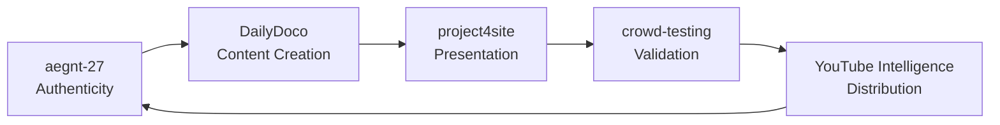
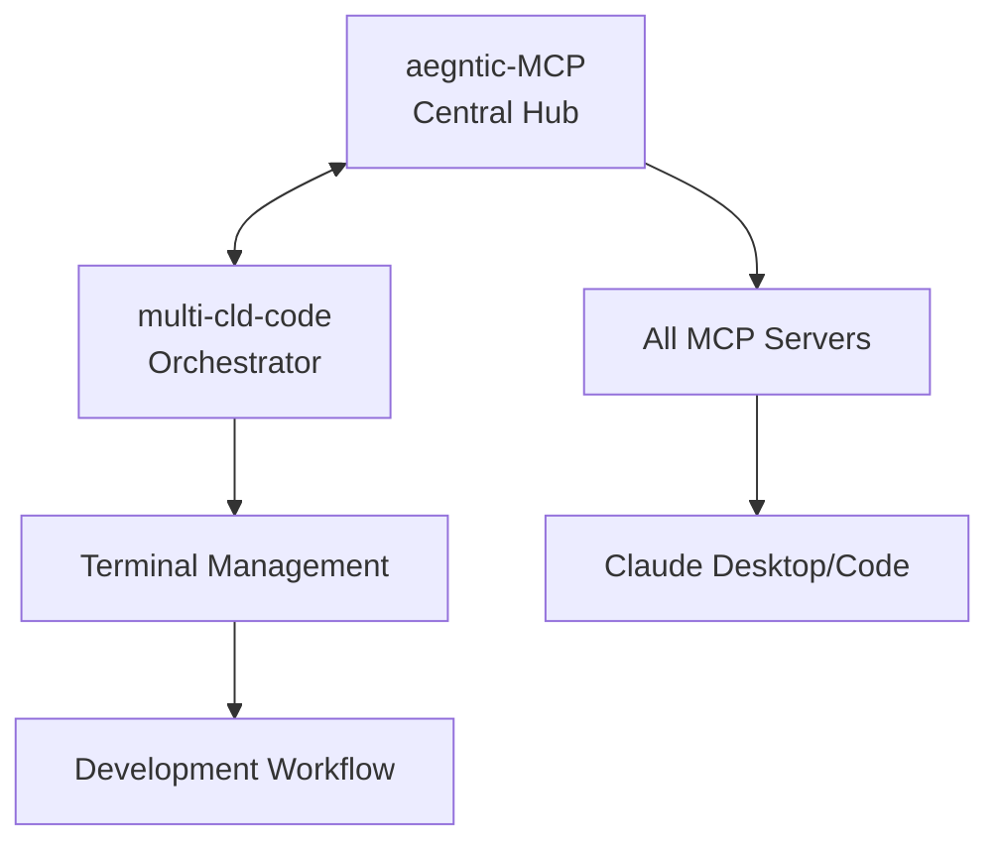
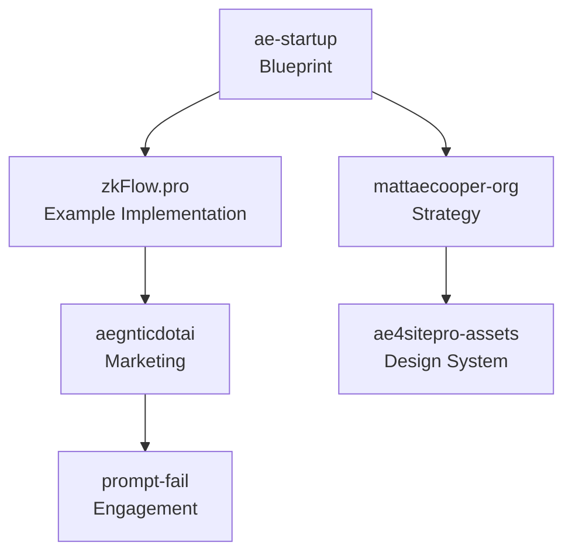
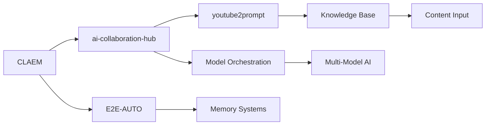

# 🌐 AEGNTIC ECOSYSTEM - Complete Interactive Mindmap

*Click on any section to expand/collapse. Each module is interconnected within the ecosystem.*

## 🏢 AE-CO-SYSTEM
> **The comprehensive AI and automation ecosystem containing 40+ elite-tier platforms**

<details>
<summary>📁 <b>Core Development Platforms</b> (Click to expand)</summary>

### 🎬 DAILYDOCO
> **Main automated documentation platform with AI test audience validation**
- **Purpose**: Revolutionary documentation & video creation platform
- **Key Features**: 
  - AI test audience (50-100 synthetic viewers)
  - Automated video generation
  - Documentation automation
  - Personal brand learning system
- **Architecture**:
  ```
  DAILYDOCO/
  ├── apps/
  │   ├── web-dashboard (React + Vite)
  │   ├── desktop (Tauri + Rust)
  │   ├── browser-ext (Chrome/Firefox)
  │   ├── api-server (Express.js)
  │   └── mcp-server (@dailydoco/mcp-server)
  ├── libs/
  │   ├── aegnt-27 (Human authenticity engine)
  │   ├── shared-types (TypeScript definitions)
  │   ├── ai-models (ML implementations)
  │   └── test-audience (AI simulation)
  └── R&D/
      ├── youtube-intelligence-engine
      ├── aegntix-ui
      └── disler-patterns
  ```
- **Connections**: 
  - → Integrates `aegnt-27` for authenticity
  - → Uses `AegntiX` for orchestration
  - → Feeds into `YouTube Intelligence Engine`
  - → Validates with `crowd-testing`

### 🤖 aegnt-27-standalone
> **Human Peak Protocol - AI authenticity achievement system**
- **Purpose**: Achieve 95%+ human authenticity in AI-generated content
- **Key Features**:
  - 🖱️ Mouse movement authenticity (96%)
  - ⌨️ Typing pattern humanization (95%)
  - 🛡️ AI detection resistance (98%+)
  - 🎙️ Audio processing (94%)
  - 👁️ Visual enhancement (93%)
- **Tech Stack**: Rust + TypeScript MCP server
- **Connections**:
  - → Core library for `DailyDoco`
  - → Available as MCP server
  - → Used by `project4site` for content
  - → Integrated in `multi-cld-code`

### 🔄 multi-cld-code (CCTM)
> **Claude Code Terminal Manager - Hub-Engine Architecture**
- **Purpose**: Orchestrate multiple Claude Code sessions with intelligent coordination
- **Architecture**:
  ```
  Hub-Engine System
  ├── Master Hub (Rust)
  │   ├── Project Registry
  │   ├── Dependency Graph
  │   └── State Manager
  └── Engine Pool
      ├── Terminal Virtualization (50+)
      ├── MCP Auto-discovery
      └── Cross-project Analysis
  ```
- **Key Features**:
  - Master Hub + Multiple Engine architecture
  - Cross-project dependency analysis
  - Terminal virtualization (50+ concurrent)
  - MCP auto-discovery
- **Connections**:
  - → Integrates all MCP servers
  - → Manages `CLAEM` workflows
  - → Coordinates `E2E-AUTO-MICRO-APPS`

### 🚀 project4site
> **AI-Powered Presentation Intelligence Platform**
- **Purpose**: Transform GitHub repos into professional multimedia experiences
- **Key Features**:
  - Zero-config website generation
  - AI-powered video creation
  - Interactive roadmaps
  - Viral mechanics (20%→25%→40% commissions)
- **Business Model**: 
  - Freemium: $5-$100+/month
  - Enterprise: Custom pricing
- **Connections**:
  - → Uses `aegnt-27` for authenticity
  - → Integrates with GitHub
  - → Leverages `ae4sitepro-assets` for UI
  - → Implements `ae-startup` principles

</details>

<details>
<summary>📁 <b>AI & Automation Modules</b> (Click to expand)</summary>

### 🧠 aegntic-MCP
> **Dynamic MCP server generator and management system**
- **Purpose**: Unified MCP configuration across Claude Desktop/Code
- **MCP Servers**:
  ```
  aegntic-MCP/
  ├── Aegntic Knowledge Engine (20 tools)
  ├── AI Collaboration Hub
  ├── Claude Export MCP
  ├── Firebase Studio MCP
  ├── n8n MCP
  └── Docker MCP
  ```
- **Connections**:
  - → Central hub for all MCP integrations
  - → Managed by `multi-cld-code`
  - → Powers `CLAEM` infrastructure

### 🎯 ae-startup
> **Aegntic Creator Studio - AI Startup in 3 Hours**
- **Purpose**: Blueprint for building dominant AI-native businesses
- **Framework**:
  ```
  3-Hour Startup Framework
  ├── Hour 1: Product-Market Fit AI
  ├── Hour 2: 50+ Microservices Design
  └── Hour 3: Launch & Scale Automation
  ```
- **Features**:
  - 30-day execution plan
  - 100x business framework
  - Time compression (weeks → hours)
  - $10M ARR templates
- **Connections**:
  - → Implemented by `zkFlow.pro`
  - → Uses entire ecosystem
  - → Documented in `mattaecooper-org`

### 🧪 crowd-testing
> **AI Test Audience Module**
- **Purpose**: Predictive video performance through synthetic viewer simulation
- **Capabilities**:
  ```
  Synthetic Personas (50-100)
  ├── Engagement Prediction
  ├── Drop-off Analysis
  ├── Comment Generation
  └── Personal Brand Learning
  ```
- **Connections**:
  - → Core component of `DailyDoco Pro`
  - → Validates `project4site` content
  - → Feeds data to `YouTube Intelligence`

### 🎮 E2E-AUTO-MICRO-APPS
> **End-to-end automation micro-applications**
- **Purpose**: Memory integration and conversation capture
- **Features**:
  - Claude conversation capture
  - Memory bank integration
  - Bootstrap scripts
  - Automation templates
- **Connections**:
  - → Enhances Claude interactions
  - → Integrates with `CLAEM`
  - → Managed by `multi-cld-code`

</details>

<details>
<summary>📁 <b>Knowledge & Learning Systems</b> (Click to expand)</summary>

### 📚 CLAEM
> **Claude-Assisted Engineering Methodology**
- **Purpose**: Advanced collaboration and export tools
- **Components**:
  ```
  CLAEM/
  ├── just-prompt-orchestration/
  ├── claude-export-tools/
  ├── core-collaboration-system/
  └── mcp-integration/
  ```
- **Connections**:
  - → Infrastructure for Claude workflows
  - → Powers `ai-collaboration-hub`
  - → Integrated with `multi-cld-code`

### 🧠 ai-collaboration-hub
> **AI-powered collaboration tools**
- **Purpose**: Multi-model AI coordination
- **Features**:
  - OpenRouter integration
  - Model orchestration
  - Collaborative workflows
  - Cost optimization
- **Connections**:
  - → Used by `aegntic-MCP`
  - → Integrates all AI components
  - → Powers `youtube2prompt`

### 🎥 youtube2prompt
> **YouTube content to prompt converter**
- **Purpose**: Extract knowledge from YouTube videos
- **Tech Stack**:
  ```
  youtube2prompt/
  ├── GUI Interface
  ├── Streamlit App
  └── API Endpoints
  ```
- **Connections**:
  - → Feeds `YouTube Intelligence Engine`
  - → Uses `ai-collaboration-hub`
  - → Integrates with `CLAEM`

### 🔬 DAILYDOCO/R&D/
> **Research & Development Projects**
- **YouTube Intelligence Engine**
  - FastAPI + React
  - Knowledge graph builder
  - Content analysis AI
- **AegntiX UI**
  - AI orchestration platform
  - React + Three.js
  - Real-time collaboration
- **disler-patterns**
  - Organizational patterns
  - `.claude/` methodology
  - AI-enhanced workflows
- **Connections**:
  - → Future production modules
  - → Testing ground for innovations
  - → Feeds back to core platforms

</details>

<details>
<summary>📁 <b>Business & Marketing Platforms</b> (Click to expand)</summary>

### 💼 zkFlow.pro
> **Chrome extension and website automation platform**
- **Purpose**: Complete business automation example
- **Implementation**:
  ```
  zkFlow.pro Success Metrics
  ├── Chrome Store: Featured
  ├── Revenue: $125K MRR
  ├── Users: 50,000+
  └── Automation: 100%
  ```
- **Tech**: Extensive automation scripts
- **Connections**:
  - → Implements `ae-startup` blueprint
  - → Uses `aegnt-27` for content
  - → Marketing via `aegnticdotai`

### 🌐 aegnticdotai
> **Main aegntic ecosystem website**
- **Purpose**: Public-facing website for aegntic
- **Tech Stack**:
  ```
  Next.js 15 + App Router
  ├── Tailwind CSS v4
  ├── Shadcn UI Components
  └── Vercel Deployment
  ```
- **Connections**:
  - → Marketing for entire ecosystem
  - → Uses `ae4sitepro-assets` design
  - → Links to all products

### 🎨 ae4sitepro-assets
> **Premium UI component library & templates**
- **Purpose**: Reusable design system
- **Contents**:
  ```
  58 Premium Components
  ├── Navigation (8)
  ├── Interactive (12)
  ├── Content (10)
  ├── Forms (8)
  ├── Media (6)
  ├── E-commerce (6)
  ├── Data (4)
  └── Advanced (4)
  ```
- **Features**:
  - Glass morphism designs
  - WebGL/shader backgrounds
  - Drag-and-drop gallery
- **Connections**:
  - → Design system for all frontends
  - → Used by `project4site`
  - → Powers `aegnticdotai`

### 📝 mattaecooper-org
> **Personal/organizational website and whitepapers**
- **Purpose**: Thought leadership and strategic documentation
- **Content**:
  - Computational Amplification whitepaper
  - Ecosystem analysis documents
  - Market projections ($415B TAM)
  - Strategic roadmaps
- **Connections**:
  - → Strategic foundation
  - → Documents `ae-startup`
  - → Vision for ecosystem

</details>

<details>
<summary>📁 <b>Utility & Fun Projects</b> (Click to expand)</summary>

### 😄 prompt-fail
> **Interactive website showcasing creative AI failures**
- **Purpose**: Educational and marketing through humor
- **Features**:
  ```
  Interactive Experience
  ├── Glitch Animations
  ├── AI Failure Gallery
  ├── Community Submissions
  └── Viral Sharing
  ```
- **Tech**: Pure HTML/CSS/JS with creative animations
- **Connections**:
  - → Marketing tool for ecosystem
  - → Demonstrates AI limitations
  - → Drives traffic to main products

### 🦕 STEGOSAURUS-WRECKS
> **Steganography application**
- **Purpose**: Hide messages in images
- **Tech**: Python Flask application
- **Features**:
  - Image encoding/decoding
  - Multiple algorithms
  - Web interface
- **Connections**:
  - → Standalone utility
  - → Potential integration with security features

### 🧩 PRE-PROMPT-QUIZ-MASTER
> **Pre-initialization quiz system**
- **Purpose**: User onboarding and assessment
- **Features**:
  - Adaptive questioning
  - Skill assessment
  - Personalization engine
- **Connections**:
  - → Can integrate with any platform
  - → Feeds user data to AI systems

</details>

<details>
<summary>📁 <b>Infrastructure & Support</b> (Click to expand)</summary>

### 🖥️ aegntic-desktop
> **Desktop application framework**
- **Purpose**: Native desktop app development
- **Tech Stack**:
  ```
  Electron Framework
  ├── Docker Integration
  ├── Cross-platform Build
  └── Auto-update System
  ```
- **Connections**:
  - → Desktop versions of web platforms
  - → Integrates with local MCP servers

### 🔧 mcp-servers
> **Additional MCP server implementations**
- **Contains**:
  - `aegntic-knowledge-engine` - RAG and knowledge management
  - `firebase-studio-mcp` - Firebase integration
  - `pickd` - Selection and picking tools
  - `quick-data` - Analytics and data processing
- **Connections**:
  - → Extended MCP ecosystem
  - → Managed by `aegntic-MCP`

### 📋 workflows
> **Reusable workflow templates**
- **Purpose**: Standardized processes across projects
- **Contents**:
  - GitHub Actions
  - Deployment scripts
  - Testing workflows
  - Automation templates
- **Connections**:
  - → Used by all projects
  - → Enforces best practices

### 🔒 .claude
> **Global AI instructions and configuration**
- **Purpose**: Consistent AI behavior across ecosystem
- **Contents**:
  ```
  .claude/
  ├── CLAUDE.md (Global instructions)
  ├── global-mcp-config.json
  ├── prompts/ (Reusable prompts)
  └── projects/ (Per-project configs)
  ```
- **Connections**:
  - → Applied to all Claude interactions
  - → Ensures consistent AI behavior

### 🔗 claudeism
> **Claude-related resources and patterns**
- **Purpose**: Best practices for Claude integration
- **Connections**:
  - → Informs `.claude` configurations
  - → Used by `CLAEM`

</details>

---

## 🔗 Key Interconnection Flows

### **1. Core Technology Flow**


### **2. MCP Integration Network**


### **3. Business Implementation Chain**


### **4. AI Enhancement Pipeline**


---

## 🎯 Ecosystem Principles

1. **🔧 Modular Architecture**: Each component works standalone or integrated
2. **🤖 AI-Native Design**: Every tool leverages AI for 10x productivity
3. **🎭 Human Authenticity**: 95%+ undetectable AI content across all outputs
4. **⚡ Speed Optimization**: Bun/UV/Cargo for maximum performance
5. **🔒 Privacy-First**: Local processing, granular permissions
6. **📈 Viral Mechanics**: Built-in growth systems (referrals, sharing)
7. **⏱️ Time Compression**: Weeks → Hours for every process
8. **💰 Cost Optimization**: 95% reduction using local AI models

---

## 📊 Technology Distribution

| Category | Percentage | Primary Use |
|----------|------------|-------------|
| **TypeScript** | 40% | Frontend, MCP servers, APIs |
| **Python** | 30% | AI/ML, automation, analytics |
| **Rust** | 20% | Performance-critical components |
| **Other** | 10% | Shell scripts, configs, docs |

### **Runtime Preferences**
- **JavaScript/TypeScript**: Bun (preferred), Node.js (legacy)
- **Python**: UV (preferred), pip (legacy)
- **Rust**: Cargo (standard)

### **AI Model Stack**
- **Reasoning**: DeepSeek R1.1 (95% cost reduction)
- **Local**: Gemma 3 (privacy-critical)
- **Image**: Flux.1 (real-time generation)
- **Multimodal**: Gemini 2.5 Pro (1M+ context)

### **Database Technologies**
- **Relational**: PostgreSQL
- **Graph**: Neo4j
- **Cache**: Redis
- **Embedded**: SQLite
- **Document**: MongoDB

---

## 🚀 Quick Navigation

### **By Purpose**
- **Documentation**: [DailyDoco](#-dailydoco) | [crowd-testing](#-crowd-testing)
- **AI Authenticity**: [aegnt-27](#-aegnt-27-standalone) | [prompt-fail](#-prompt-fail)
- **Business Tools**: [ae-startup](#-ae-startup) | [project4site](#-project4site)
- **Development**: [multi-cld-code](#-multi-cld-code-cctm) | [CLAEM](#-claem)
- **Marketing**: [aegnticdotai](#-aegnticdotai) | [zkFlow.pro](#-zkflowpro)

### **By Technology**
- **Rust Projects**: [aegnt-27](#-aegnt-27-standalone) | [multi-cld-code](#-multi-cld-code-cctm)
- **TypeScript**: [DailyDoco](#-dailydoco) | [aegntic-MCP](#-aegntic-mcp)
- **Python**: [youtube2prompt](#-youtube2prompt) | [crowd-testing](#-crowd-testing)
- **React Apps**: [DailyDoco Dashboard](#-dailydoco) | [AegntiX UI](#-dailydocord)

### **By Status**
- **Production**: [zkFlow.pro](#-zkflowpro) | [aegnt-27](#-aegnt-27-standalone)
- **Active Development**: [DailyDoco](#-dailydoco) | [project4site](#-project4site)
- **R&D**: [YouTube Intelligence](#-dailydocord) | [AegntiX](#-dailydocord)
- **Utilities**: [STEGOSAURUS-WRECKS](#-stegosaurus-wrecks) | [prompt-fail](#-prompt-fail)

---

## 📚 How to Use This Mindmap

1. **Click any section** to expand/collapse details
2. **Follow connection arrows** to understand relationships
3. **Use Quick Navigation** to jump to specific modules
4. **Check Technology Distribution** for stack decisions
5. **Review Ecosystem Principles** for design philosophy

Each module in this ecosystem is designed to work independently while gaining exponential value when integrated with others, creating a comprehensive AI-enhanced development platform that enables 10x-100x productivity gains through intelligent automation and AI augmentation.

---

*Last Updated: January 2025 | Total Modules: 40+ | Active Development: 25+ | Production Ready: 15+*