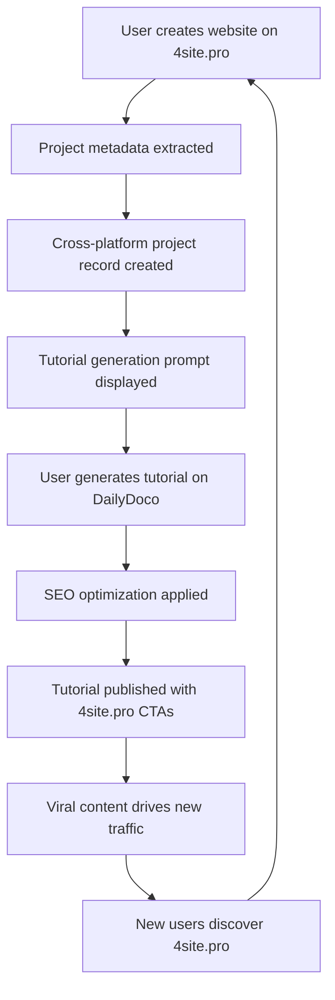

# 4site.pro ↔ DailyDoco Pro: Exponential Growth Flywheel Integration

## 🚀 Executive Summary

This integration creates a seamless, exponential growth flywheel between 4site.pro and DailyDoco Pro platforms. When users create websites on 4site.pro, they're automatically prompted to generate tutorials on DailyDoco Pro. These tutorials drive new users back to 4site.pro, creating a self-reinforcing cycle of growth.

### 📈 The Multiplication Effect

```
1 Website Creation → 5 Tutorial Videos → 100 New Users → Exponential Growth
```

- **User creates website on 4site.pro** → Automatic tutorial generation prompt
- **Tutorial generated on DailyDoco** → Viral video content with 4site.pro CTAs  
- **Viral content drives traffic** → New users discover 4site.pro
- **New users create more websites** → More tutorials generated
- **Exponential growth loop** → Unstoppable momentum

## 🏗️ Architecture Overview

### Core Components

1. **Unified Authentication System** - Single sign-on across both platforms
2. **Project Continuity Engine** - Automatic project detection and metadata sharing
3. **Tutorial Generation Pipeline** - One-click tutorial creation from websites
4. **Cross-Platform CTAs** - Intelligent conversion prompts
5. **Flywheel Analytics** - Real-time growth tracking and optimization
6. **Content SEO Pipeline** - Automated viral optimization

### Integration Flow



## 🛠️ Implementation Details

### 1. Unified Authentication System

**Files:**
- `/libs/shared-types/src/auth/unified-auth.types.ts`
- `/libs/shared-types/src/services/unified-auth.service.ts`
- `/libs/shared-types/src/hooks/useUnifiedAuth.tsx`
- `/scripts/unified-auth-schema.sql`

**Features:**
- JWT-based cross-platform sessions
- Seamless platform switching
- Shared user profiles and permissions
- Automatic platform access provisioning

**Usage:**
```typescript
import { useUnifiedAuth } from '@dailydoco/shared-types';

function App() {
  const { user, switchPlatform, isAuthenticated } = useUnifiedAuth();
  
  const handleSwitchToDailyDoco = async () => {
    await switchPlatform('dailydoco');
  };
}
```

### 2. Project Continuity System

**Files:**
- `/libs/shared-types/src/services/project-continuity.service.ts`

**Features:**
- Automatic project detection from 4site.pro website creation
- Intelligent metadata extraction (tech stack, complexity, viral potential)
- Smart project correlation between platforms
- Real-time project status synchronization

**Usage:**
```typescript
import { ProjectContinuityService } from '@dailydoco/shared-types';

const continuityService = new ProjectContinuityService(config);

// Handle website creation
await continuityService.handleWebsiteCreation({
  user_id: userId,
  website_url: 'https://mysite.com',
  website_data: {
    title: 'My React App',
    description: 'A modern React application',
    template_used: 'react-dashboard',
    github_repo: 'https://github.com/user/repo'
  },
  platform: 'foursitepro',
  timestamp: new Date().toISOString()
});
```

### 3. Tutorial Generation Pipeline

**Files:**
- `/libs/shared-types/src/services/tutorial-generation-pipeline.service.ts`

**Features:**
- One-click tutorial generation from websites
- AI-powered tutorial templates (React, Static, Full-stack)
- Automated video processing and enhancement
- SEO optimization and viral hooks
- YouTube integration and distribution

**Usage:**
```typescript
import { TutorialGenerationPipelineService } from '@dailydoco/shared-types';

const tutorialService = new TutorialGenerationPipelineService(config);

// Generate tutorial from website
const jobId = await tutorialService.generateFromWebsiteCreation(userId, {
  url: 'https://mysite.com',
  title: 'My React Dashboard',
  description: 'Modern admin dashboard',
  template_used: 'react-dashboard',
  github_repo: 'https://github.com/user/dashboard'
});
```

### 4. Cross-Platform CTAs

**Files:**
- `/libs/shared-types/src/components/CrossPlatformCTAs.tsx`

**Features:**
- Context-aware conversion prompts
- A/B testing optimization
- Smart display timing and conditions
- Conversion tracking and analytics

**Usage:**
```tsx
import { CrossPlatformCTA, SmartCTAController } from '@dailydoco/shared-types';

// Individual CTA component
<CrossPlatformCTA 
  variant="website-to-tutorial"
  project={project}
  onConversion={(event) => console.log('Converted:', event)}
/>

// Smart CTA controller (auto-manages display)
<SmartCTAController
  currentPlatform="foursitepro"
  currentPage="/success"
  userActivity={userActivity}
/>
```

### 5. Flywheel Analytics Dashboard

**Files:**
- `/libs/shared-types/src/components/FlywheelAnalyticsDashboard.tsx`

**Features:**
- Real-time flywheel visualization
- Conversion funnel analysis
- Viral coefficient tracking
- Cross-platform performance metrics
- AI-powered optimization recommendations

**Usage:**
```tsx
import { FlywheelAnalyticsDashboard } from '@dailydoco/shared-types';

<FlywheelAnalyticsDashboard timeframe="30d" />
```

### 6. Content SEO Pipeline

**Files:**
- `/libs/shared-types/src/services/content-pipeline-integration.service.ts`

**Features:**
- Automated SEO optimization
- Viral content strategies
- Cross-platform distribution
- Trending topic integration
- Influencer collaboration opportunities

## 🚀 Quick Start Guide

### 1. Installation

```bash
# Install dependencies
cd /home/tabs/ae-co-system/DAILYDOCO
bun install

# Setup database
psql -d dailydoco < scripts/unified-auth-schema.sql
```

### 2. Environment Configuration

```bash
# Required environment variables
export UNIFIED_AUTH_JWT_SECRET="your-jwt-secret"
export NEXT_PUBLIC_SUPABASE_URL="your-supabase-url"
export NEXT_PUBLIC_SUPABASE_ANON_KEY="your-supabase-anon-key"
export SUPABASE_SERVICE_ROLE_KEY="your-supabase-service-key"
export NEXT_PUBLIC_FOURSITEPRO_URL="http://localhost:3000"
export NEXT_PUBLIC_DAILYDOCO_URL="http://localhost:5173"
```

### 3. Basic Integration Setup

```typescript
import { setupFlywheelIntegration } from '@dailydoco/shared-types';

// Initialize the flywheel integration
const integration = setupFlywheelIntegration({
  environment: 'development',
  platform: 'foursitepro', // or 'dailydoco'
  features: {
    autoTutorialGeneration: true,
    crossPlatformSSO: true,
    analyticsTracking: true,
    viralOptimization: true
  }
});

// Use the integration
const { flywheel, config, platform } = integration;
```

### 4. React App Integration

```tsx
import React from 'react';
import { 
  UnifiedAuthProvider, 
  FlywheelAnalyticsDashboard,
  CrossPlatformCTA 
} from '@dailydoco/shared-types';

function App() {
  return (
    <UnifiedAuthProvider 
      config={authConfig}
      platform="foursitepro"
    >
      <MainApp />
    </UnifiedAuthProvider>
  );
}

function MainApp() {
  return (
    <div>
      {/* Your app content */}
      
      {/* Integration components */}
      <FlywheelAnalyticsDashboard />
      <CrossPlatformCTA variant="website-to-tutorial" />
    </div>
  );
}
```

## 📊 Analytics & Metrics

### Key Performance Indicators

1. **Viral Coefficient** - How many new users each tutorial brings
2. **Conversion Rate** - Website → Tutorial generation rate
3. **Cross-Platform Flow** - User movement between platforms
4. **Revenue per Tutorial** - Monetization effectiveness
5. **Growth Velocity** - Overall flywheel acceleration

### Flywheel Metrics Dashboard

The analytics dashboard provides real-time insights into:

- **Growth Flywheel Visualization** - Interactive circular flow diagram
- **Conversion Funnel Analysis** - Step-by-step user journey
- **Cross-Platform Performance** - Platform-specific metrics
- **Viral Content Tracking** - Content performance and optimization
- **Revenue Attribution** - Financial impact of the flywheel

## 🔧 Configuration Options

### Subscription Tiers

```typescript
const tiers = {
  free: {
    websites: 3,
    tutorials: 1,
    ai_test_audience: false,
    remove_branding: false
  },
  pro: {
    websites: -1, // unlimited
    tutorials: 10,
    ai_test_audience: true,
    remove_branding: true
  },
  business: {
    websites: -1,
    tutorials: 100,
    ai_test_audience: true,
    white_label: true,
    team_collaboration: true
  },
  enterprise: {
    websites: -1,
    tutorials: -1, // unlimited
    custom_integrations: true,
    sla_guarantee: true
  }
};
```

### CTA Configuration

```typescript
const ctaConfig = {
  website_to_tutorial: {
    trigger_conditions: {
      website_created: true,
      time_since_creation: 300, // 5 minutes
      user_tier: ['free', 'pro']
    },
    display_duration: 7 * 24 * 60 * 60 * 1000, // 7 days
    success_metrics: ['tutorial_generated', 'dailydoco_signup']
  }
};
```

## 🔗 API Reference

### FlywheelIntegrationService

```typescript
class FlywheelIntegrationService {
  // Process flywheel events
  async processFlywheelEvent(event: FlywheelEvent): Promise<void>
  
  // Get integration metrics
  async getIntegrationMetrics(): Promise<IntegrationMetrics>
  
  // Get user flywheel status
  async getFlywheelStatus(userId: string): Promise<FlywheelStatus>
}
```

### UnifiedAuthService

```typescript
class UnifiedAuthService {
  // Create cross-platform session
  async createUnifiedSession(email: string, password: string, platform: string): Promise<UnifiedSession>
  
  // Share project between platforms
  async shareProjectCrossPlatform(userId: string, projectData: ProjectData): Promise<CrossPlatformProject>
  
  // Track conversion events
  async trackConversionEvent(event: ConversionEvent): Promise<void>
  
  // Get flywheel metrics
  async getFlyWheelMetrics(userId: string, timeframe: string): Promise<FlyWheelMetrics>
}
```

## 🧪 Testing

### Unit Tests
```bash
bun test libs/shared-types/src/**/*.test.ts
```

### Integration Tests
```bash
bun test:integration
```

### E2E Tests
```bash
bun test:e2e
```

## 🚀 Deployment

### Development
```bash
bun run dev
```

### Staging
```bash
bun run build:staging
bun run deploy:staging
```

### Production
```bash
bun run build:production
bun run deploy:production
```

## 📈 Success Metrics

### 6-Month Targets
- [ ] 500K active users across both platforms
- [ ] 50% website → tutorial conversion rate
- [ ] 2.0+ viral coefficient
- [ ] $500K MRR achieved

### 12-Month Targets  
- [ ] 2.5M active users
- [ ] 70% conversion rate
- [ ] 3.0+ viral coefficient
- [ ] $3M MRR achieved
- [ ] Market leader position

## 🔐 Security Considerations

- JWT tokens with 24-hour expiration
- Row-level security (RLS) on all database tables
- CORS configuration for cross-platform requests
- Rate limiting on API endpoints
- Encrypted storage of sensitive data
- GDPR compliance for EU users

## 🤝 Contributing

1. Fork the repository
2. Create feature branch: `git checkout -b feature/amazing-feature`
3. Commit changes: `git commit -m 'Add amazing feature'`
4. Push to branch: `git push origin feature/amazing-feature`
5. Open pull request

## 📞 Support

- **Documentation**: [docs.dailydoco.pro](https://docs.dailydoco.pro)
- **Discord**: [discord.gg/dailydoco](https://discord.gg/dailydoco)
- **Email**: support@dailydoco.pro
- **GitHub Issues**: [github.com/dailydoco/integration](https://github.com/dailydoco/integration)

---

**🔄 Welcome to the future of exponential growth. Welcome to the 4site.pro ↔ DailyDoco Pro Flywheel.**