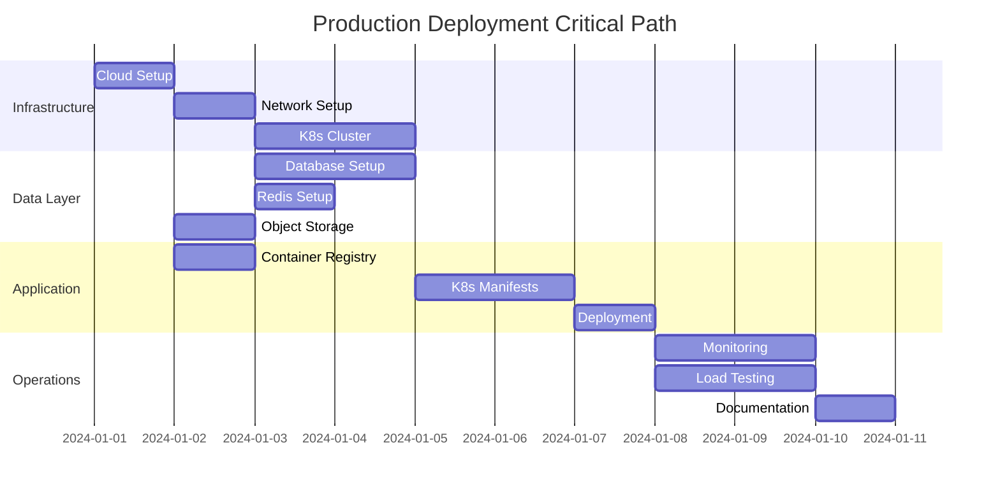

# 🚀 DailyDoco Pro Production Deployment - Comprehensive Task Breakdown

## 🧠 ULTRATHINK: Production Deployment Architecture

**Total Estimated Time**: 20-25 days with parallel execution
**Team Required**: 6-8 engineers working in parallel
**Budget Estimate**: $15,000-25,000/month infrastructure costs

---

## 📋 TASK-063: Production Deployment Master Plan

### Phase 1: Infrastructure Foundation (Days 1-3) 🏗️

#### 1.1 Cloud Provider Setup
```yaml
Task: Cloud Account and Organization Setup
Priority: CRITICAL
Assignee: DevOps Lead
Duration: 4 hours
Parallel: Can run with 1.2, 1.3

Actions:
  - [ ] Create production AWS/GCP organization
  - [ ] Set up billing alerts ($5k, $10k, $25k)
  - [ ] Configure multi-region architecture
  - [ ] Enable CloudTrail/Activity logging
  - [ ] Set up cost allocation tags
  - [ ] Create separate accounts for prod/staging/dev

Dependencies: None
Output: Cloud accounts ready with proper isolation
```

#### 1.2 Network Architecture
```yaml
Task: VPC and Network Security Setup
Priority: CRITICAL
Assignee: Network Engineer
Duration: 8 hours
Parallel: Can run with 1.1, 1.3

Actions:
  - [ ] Design multi-AZ VPC architecture
  - [ ] Create public/private/data subnets
  - [ ] Configure NAT gateways for private subnets
  - [ ] Set up VPC peering for cross-region
  - [ ] Configure security groups:
    - Web tier (80, 443)
    - App tier (8080, 8081)
    - Data tier (5432, 6379)
    - Management (22, 3389)
  - [ ] Set up VPN for secure admin access
  - [ ] Configure AWS WAF/Cloud Armor

Network Design:
  Production VPC: 10.0.0.0/16
    - Public:  10.0.1.0/24, 10.0.2.0/24 (Multi-AZ)
    - Private: 10.0.10.0/24, 10.0.11.0/24 (Multi-AZ)
    - Data:    10.0.20.0/24, 10.0.21.0/24 (Multi-AZ)

Dependencies: 1.1
Output: Secure network architecture deployed
```

#### 1.3 Domain and SSL Setup
```yaml
Task: DNS and Certificate Management
Priority: HIGH
Assignee: DevOps Engineer
Duration: 4 hours
Parallel: Can run with 1.1, 1.2

Actions:
  - [ ] Configure Route53/Cloud DNS
  - [ ] Set up domain records:
    - app.dailydoco.pro (main app)
    - api.dailydoco.pro (API gateway)
    - cdn.dailydoco.pro (CDN)
    - status.dailydoco.pro (status page)
  - [ ] Generate wildcard SSL certificates
  - [ ] Configure certificate auto-renewal
  - [ ] Set up CAA records for security

Dependencies: Domain ownership
Output: SSL-secured domains ready
```

### Phase 2: Container Orchestration (Days 2-4) 🎯

#### 2.1 Kubernetes Cluster Setup
```yaml
Task: EKS/GKE Cluster Deployment
Priority: CRITICAL
Assignee: DevOps Lead + K8s Engineer
Duration: 12 hours
Parallel: Depends on Phase 1

Actions:
  - [ ] Create production EKS/GKE cluster
    - Control plane: 3 nodes (HA)
    - Node pools:
      - General: 3x m5.2xlarge (auto-scaling 3-10)
      - GPU: 2x g4dn.xlarge (video processing)
      - Memory: 2x r5.2xlarge (AI models)
  - [ ] Configure cluster autoscaler
  - [ ] Install core addons:
    - Ingress controller (nginx/traefik)
    - Cert-manager
    - External-dns
    - Metrics-server
  - [ ] Set up namespaces:
    - dailydoco-prod
    - dailydoco-monitoring
    - dailydoco-security
  - [ ] Configure RBAC policies
  - [ ] Set up pod security policies

Cluster Sizing:
  - Expected load: 1000 concurrent users
  - Video processing: 50 simultaneous
  - API requests: 10k/minute peak

Dependencies: Phase 1 complete
Output: Production-ready K8s cluster
```

#### 2.2 Service Mesh Implementation
```yaml
Task: Istio/Linkerd Service Mesh
Priority: HIGH
Assignee: Platform Engineer
Duration: 8 hours
Parallel: After 2.1

Actions:
  - [ ] Install Istio/Linkerd control plane
  - [ ] Configure mTLS between services
  - [ ] Set up traffic management:
    - Circuit breakers
    - Retry policies
    - Timeout configurations
  - [ ] Configure observability:
    - Distributed tracing
    - Service metrics
    - Service graph
  - [ ] Implement canary deployment support

Dependencies: 2.1
Output: Service mesh operational
```

### Phase 3: Data Layer (Days 3-5) 💾

#### 3.1 Database Cluster Deployment
```yaml
Task: PostgreSQL + TimescaleDB Setup
Priority: CRITICAL
Assignee: Database Engineer
Duration: 12 hours
Parallel: Can start after Phase 1

Actions:
  - [ ] Deploy PostgreSQL 15 cluster:
    - Primary: db.r6g.2xlarge
    - Read replicas: 2x db.r6g.xlarge
    - Multi-AZ deployment
  - [ ] Install TimescaleDB extension
  - [ ] Configure streaming replication
  - [ ] Set up connection pooling (PgBouncer)
  - [ ] Implement backup strategy:
    - Continuous archiving to S3
    - Daily snapshots
    - Point-in-time recovery
  - [ ] Create databases:
    - dailydoco_prod (main)
    - aegnt27_prod (AI data)
    - analytics_prod (metrics)
  - [ ] Set up monitoring queries

Database Sizing:
  - Expected size: 500GB year 1
  - Connections: 500 concurrent
  - IOPS: 10k sustained

Dependencies: Network setup
Output: HA database cluster ready
```

#### 3.2 Redis Cluster Setup
```yaml
Task: Redis Cache Infrastructure
Priority: HIGH
Assignee: Backend Engineer
Duration: 6 hours
Parallel: Can run with 3.1

Actions:
  - [ ] Deploy Redis 7.0 cluster:
    - 3 masters, 3 replicas
    - cache.r6g.large instances
  - [ ] Configure Redis Sentinel
  - [ ] Set up persistence:
    - AOF for critical data
    - RDB snapshots hourly
  - [ ] Implement cache strategies:
    - Session cache (2GB)
    - API cache (5GB)
    - Video metadata (3GB)
  - [ ] Configure eviction policies
  - [ ] Set up Redis monitoring

Dependencies: Network setup
Output: Distributed cache ready
```

#### 3.3 Object Storage Configuration
```yaml
Task: S3/Cloud Storage Setup
Priority: HIGH
Assignee: Storage Engineer
Duration: 4 hours
Parallel: Can run with 3.1, 3.2

Actions:
  - [ ] Create S3 buckets:
    - dailydoco-videos-prod (main storage)
    - dailydoco-thumbnails-prod
    - dailydoco-exports-prod
    - dailydoco-backups-prod
  - [ ] Configure lifecycle policies:
    - Move to IA after 30 days
    - Archive to Glacier after 90 days
  - [ ] Set up cross-region replication
  - [ ] Configure bucket policies and CORS
  - [ ] Enable versioning and MFA delete
  - [ ] Set up CloudFront CDN:
    - Global edge locations
    - Signed URLs for private content
    - 1 year cache for static assets

Storage Estimates:
  - Videos: 50TB year 1
  - Growth rate: 200GB/day
  - Bandwidth: 100TB/month

Dependencies: Cloud account
Output: Object storage ready with CDN
```

### Phase 4: Application Deployment (Days 4-6) 🎨

#### 4.1 Container Registry Setup
```yaml
Task: ECR/GCR Configuration
Priority: HIGH
Assignee: DevOps Engineer
Duration: 2 hours
Parallel: Can start early

Actions:
  - [ ] Create container registries:
    - dailydoco/web-dashboard
    - dailydoco/api-server
    - dailydoco/mcp-server
    - dailydoco/capture-engine
    - dailydoco/video-processor
    - aegnt27/authenticity-engine
  - [ ] Configure vulnerability scanning
  - [ ] Set up image retention policies
  - [ ] Implement image signing
  - [ ] Configure pull secrets in K8s

Dependencies: Cloud account
Output: Secure container registry
```

#### 4.2 Kubernetes Manifests
```yaml
Task: Production K8s Configurations
Priority: CRITICAL
Assignee: Platform Engineer
Duration: 16 hours
Parallel: After 2.1, 4.1

Actions:
  - [ ] Create Helm charts for each service
  - [ ] Configure deployments:
    apiVersion: apps/v1
    kind: Deployment
    metadata:
      name: web-dashboard
    spec:
      replicas: 3
      strategy:
        type: RollingUpdate
        rollingUpdate:
          maxSurge: 1
          maxUnavailable: 0
      template:
        spec:
          containers:
          - name: web-dashboard
            resources:
              requests:
                memory: "512Mi"
                cpu: "500m"
              limits:
                memory: "1Gi"
                cpu: "1000m"
            livenessProbe:
              httpGet:
                path: /health
                port: 3000
              initialDelaySeconds: 30
              periodSeconds: 10
            readinessProbe:
              httpGet:
                path: /ready
                port: 3000
              initialDelaySeconds: 5
              periodSeconds: 5
  
  - [ ] Configure services and ingresses
  - [ ] Set up ConfigMaps and Secrets
  - [ ] Implement HPA (Horizontal Pod Autoscaler)
  - [ ] Configure PodDisruptionBudgets
  - [ ] Set up NetworkPolicies

Dependencies: 2.1, 4.1
Output: Production-ready K8s manifests
```

#### 4.3 Secrets Management
```yaml
Task: HashiCorp Vault / AWS Secrets Manager
Priority: CRITICAL
Assignee: Security Engineer
Duration: 8 hours
Parallel: Can run with 4.2

Actions:
  - [ ] Deploy Vault/Secrets Manager
  - [ ] Configure secret engines:
    - Database credentials
    - API keys
    - JWT signing keys
    - Encryption keys
  - [ ] Set up secret rotation:
    - DB passwords: 30 days
    - API keys: 90 days
    - Certificates: auto-renewal
  - [ ] Configure K8s integration
  - [ ] Implement least-privilege access
  - [ ] Set up audit logging

Secrets Inventory:
  - Database: 5 credentials
  - APIs: 15 keys (OpenAI, etc)
  - Certificates: 10 certs
  - Encryption: 3 master keys

Dependencies: K8s cluster
Output: Secure secrets management
```

### Phase 5: GPU Infrastructure (Days 5-6) 🎮

#### 5.1 GPU Node Pool Setup
```yaml
Task: GPU Compute for Video Processing
Priority: HIGH
Assignee: Infrastructure Engineer
Duration: 8 hours
Parallel: After Phase 2

Actions:
  - [ ] Create GPU node pool:
    - 2x g4dn.xlarge (NVIDIA T4)
    - Auto-scaling 2-8 nodes
    - Spot instances for cost savings
  - [ ] Install NVIDIA drivers
  - [ ] Deploy NVIDIA device plugin
  - [ ] Configure GPU scheduling:
    - Time-slicing for small jobs
    - Exclusive for 4K processing
  - [ ] Set up GPU monitoring:
    - Utilization metrics
    - Temperature monitoring
    - Memory usage
  - [ ] Implement job queuing

GPU Allocation:
  - 4K processing: 1 full GPU
  - 1080p processing: 0.5 GPU
  - Thumbnail generation: 0.25 GPU

Dependencies: K8s cluster
Output: GPU processing ready
```

### Phase 6: CI/CD Pipeline (Days 4-7) 🔄

#### 6.1 GitHub Actions Setup
```yaml
Task: Production CI/CD Pipeline
Priority: HIGH
Assignee: DevOps Engineer
Duration: 12 hours
Parallel: Can start early

Actions:
  - [ ] Configure GitHub Actions:
    name: Production Deployment
    on:
      push:
        branches: [main]
      workflow_dispatch:
    
    jobs:
      test:
        runs-on: ubuntu-latest
        steps:
        - uses: actions/checkout@v3
        - name: Run tests
          run: |
            npm test
            cargo test
        
      build:
        needs: test
        strategy:
          matrix:
            service: [web, api, mcp, capture]
        steps:
        - name: Build and push
          run: |
            docker build -t $SERVICE:$SHA .
            docker push $REGISTRY/$SERVICE:$SHA
      
      deploy:
        needs: build
        steps:
        - name: Deploy to production
          run: |
            helm upgrade --install $SERVICE \
              --set image.tag=$SHA \
              --wait --timeout 10m

  - [ ] Set up environments:
    - Development
    - Staging  
    - Production
  - [ ] Configure branch protection
  - [ ] Implement automated rollback
  - [ ] Set up deployment notifications

Dependencies: Container registry
Output: Automated deployment pipeline
```

### Phase 7: Monitoring Stack (Days 6-8) 📊

#### 7.1 Metrics and Monitoring
```yaml
Task: Prometheus + Grafana Setup
Priority: CRITICAL
Assignee: SRE Engineer
Duration: 12 hours
Parallel: After Phase 4

Actions:
  - [ ] Deploy Prometheus operator
  - [ ] Configure service monitors:
    - Application metrics
    - Infrastructure metrics
    - Custom business metrics
  - [ ] Deploy Grafana with dashboards:
    - System overview
    - Application performance
    - Video processing pipeline
    - User activity
    - Cost tracking
  - [ ] Set up alerting rules:
    - CPU > 80% for 5 minutes
    - Memory > 90%
    - Disk > 85%
    - Error rate > 1%
    - Processing time > 2x target
  - [ ] Configure alert routing:
    - Critical: PagerDuty
    - Warning: Slack
    - Info: Email

Key Metrics:
  - Golden signals (latency, traffic, errors, saturation)
  - Business KPIs (videos processed, user engagement)
  - Cost per video processed

Dependencies: K8s cluster
Output: Comprehensive monitoring
```

#### 7.2 Log Aggregation
```yaml
Task: ELK Stack Deployment
Priority: HIGH
Assignee: Platform Engineer
Duration: 8 hours
Parallel: Can run with 7.1

Actions:
  - [ ] Deploy Elasticsearch cluster:
    - 3 nodes for HA
    - 2TB storage per node
  - [ ] Configure Logstash pipelines:
    - Application logs
    - Access logs
    - Error logs
    - Audit logs
  - [ ] Deploy Kibana dashboards:
    - Error analysis
    - User journey tracking
    - Performance analytics
  - [ ] Set up log retention:
    - Hot: 7 days
    - Warm: 30 days
    - Cold: 90 days
  - [ ] Configure log shipping:
    - Fluentd daemonset
    - Log parsing rules
    - Structured logging

Log Volume:
  - Expected: 100GB/day
  - Retention: 90 days
  - Searchable: 30 days

Dependencies: K8s cluster
Output: Centralized logging
```

### Phase 8: Security Hardening (Days 7-9) 🔒

#### 8.1 Security Scanning
```yaml
Task: Vulnerability Management
Priority: CRITICAL
Assignee: Security Engineer
Duration: 8 hours
Parallel: Throughout deployment

Actions:
  - [ ] Container scanning:
    - Trivy in CI/CD
    - Runtime scanning
    - License compliance
  - [ ] Dependency scanning:
    - npm audit
    - cargo audit
    - OWASP dependency check
  - [ ] Infrastructure scanning:
    - AWS Security Hub
    - Cloud Security Scanner
    - CIS benchmarks
  - [ ] Code analysis:
    - SonarQube
    - CodeQL
    - Semgrep
  - [ ] Penetration testing prep

Security Checklist:
  - [ ] No high/critical CVEs
  - [ ] Secrets not in code
  - [ ] HTTPS everywhere
  - [ ] Authentication required
  - [ ] Rate limiting enabled

Dependencies: Applications deployed
Output: Security report
```

#### 8.2 DDoS and WAF Protection
```yaml
Task: CloudFlare/AWS Shield Setup
Priority: HIGH
Assignee: Security Engineer
Duration: 6 hours
Parallel: Can run anytime

Actions:
  - [ ] Configure DDoS protection:
    - AWS Shield Advanced
    - CloudFlare Enterprise
  - [ ] Set up WAF rules:
    - OWASP Top 10
    - Bot protection
    - Rate limiting
    - Geo-blocking (if needed)
  - [ ] Configure security headers:
    - CSP
    - HSTS
    - X-Frame-Options
  - [ ] Implement CAPTCHA:
    - Suspicious activity
    - Failed login attempts

Protection Targets:
  - API: 10k req/min per IP
  - Web: 1k req/min per IP
  - Video: 100 req/min per IP

Dependencies: Load balancer
Output: DDoS protection active
```

### Phase 9: Performance Testing (Days 8-10) 🏃

#### 9.1 Load Testing
```yaml
Task: K6/Locust Load Testing
Priority: HIGH
Assignee: Performance Engineer
Duration: 16 hours
Parallel: After deployment

Actions:
  - [ ] Design test scenarios:
    - User registration flow
    - Video capture simulation
    - AI processing pipeline
    - Export generation
  - [ ] Execute load tests:
    stages: [
      { duration: '5m', target: 100 },   // Ramp up
      { duration: '10m', target: 100 },  // Stay at 100
      { duration: '5m', target: 500 },   // Ramp to 500
      { duration: '10m', target: 500 },  // Stay at 500
      { duration: '5m', target: 1000 },  // Ramp to 1000
      { duration: '20m', target: 1000 }, // Stay at 1000
      { duration: '5m', target: 0 },     // Ramp down
    ]
  - [ ] Analyze results:
    - Response times
    - Error rates
    - Resource utilization
    - Bottlenecks
  - [ ] Tune performance:
    - Database indexes
    - Cache strategies
    - Resource limits

Performance Targets:
  - API latency: < 100ms p95
  - Video processing: < 2x realtime
  - Dashboard load: < 3 seconds
  - Concurrent users: 1000+

Dependencies: Full deployment
Output: Performance report
```

### Phase 10: Documentation & Training (Days 9-10) 📚

#### 10.1 Runbook Creation
```yaml
Task: Operational Documentation
Priority: HIGH
Assignee: Technical Writer + SRE
Duration: 12 hours
Parallel: Throughout deployment

Actions:
  - [ ] Create runbooks:
    1. Deployment procedures
    2. Rollback procedures
    3. Scaling procedures
    4. Troubleshooting guides
    5. Incident response
    6. Disaster recovery
    7. Security incidents
    8. Performance issues
  - [ ] Document architecture:
    - System diagrams
    - Data flow diagrams
    - Network topology
    - Security boundaries
  - [ ] Create dashboards guide:
    - Metric meanings
    - Alert responses
    - Investigation steps

Runbook Template:
  # Service Name Runbook
  ## Overview
  ## Common Issues
  ## Troubleshooting Steps
  ## Escalation Path
  ## Recovery Procedures

Dependencies: Deployment complete
Output: Operational runbooks
```

#### 10.2 Team Training
```yaml
Task: Operations Training
Priority: HIGH
Assignee: Team Lead
Duration: 8 hours
Parallel: Final phase

Actions:
  - [ ] Conduct training sessions:
    - Architecture overview
    - Deployment procedures
    - Monitoring and alerts
    - Incident response
    - Security protocols
  - [ ] Set up on-call rotation:
    - Primary: 24/7 coverage
    - Secondary: Backup
    - Escalation: Management
  - [ ] Practice scenarios:
    - Simulated outages
    - Performance issues
    - Security incidents
  - [ ] Create knowledge base

Training Checklist:
  - [ ] All team members trained
  - [ ] Runbooks reviewed
  - [ ] Access verified
  - [ ] Tools familiarity
  - [ ] Emergency contacts

Dependencies: Documentation
Output: Trained ops team
```

---

## 🎯 Critical Path Analysis



---

## 📊 Resource Allocation

| Phase | Engineers | Duration | Critical Path |
|-------|-----------|----------|---------------|
| Infrastructure | 3 | 3 days | Yes |
| Container Platform | 2 | 3 days | Yes |
| Data Layer | 2 | 3 days | Partial |
| Application Deploy | 3 | 3 days | Yes |
| GPU Setup | 1 | 2 days | No |
| CI/CD | 1 | 4 days | No |
| Monitoring | 2 | 3 days | No |
| Security | 1 | 3 days | No |
| Performance | 1 | 3 days | No |
| Documentation | 2 | 2 days | No |

**Total: 6-8 engineers working in parallel for 10-12 days**

---

## 💰 Cost Breakdown

### Monthly Infrastructure Costs
```yaml
Compute:
  - K8s nodes: $2,500 (general purpose)
  - GPU nodes: $3,000 (video processing)
  - Total: $5,500

Database:
  - PostgreSQL: $1,500 (Multi-AZ)
  - Redis: $500
  - Total: $2,000

Storage:
  - S3: $2,000 (50TB + transfer)
  - Backups: $500
  - Total: $2,500

Network:
  - Load Balancer: $200
  - NAT Gateway: $300
  - CDN: $1,000
  - Total: $1,500

Monitoring:
  - Logs: $500
  - Metrics: $300
  - APM: $500
  - Total: $1,300

Security:
  - WAF: $200
  - Certificates: $100
  - Scanning: $200
  - Total: $500

Total Monthly: ~$13,300
With 20% buffer: $16,000
```

---

## ✅ Success Criteria

1. **Performance**
   - API response time < 100ms (p95)
   - Video processing < 2x realtime
   - 99.9% uptime SLA

2. **Scalability**
   - Handle 1000+ concurrent users
   - Process 500+ videos/hour
   - Auto-scale based on load

3. **Security**
   - Zero critical vulnerabilities
   - All data encrypted
   - Compliance ready

4. **Operations**
   - Full monitoring coverage
   - Automated deployments
   - Documented procedures

5. **Cost**
   - Within budget ($16k/month)
   - Cost per video < $0.50
   - Optimized resource usage

---

## 🚨 Risk Mitigation

| Risk | Impact | Mitigation |
|------|--------|------------|
| GPU availability | High | Reserve instances + spot fallback |
| Data loss | Critical | Multi-region backups + replication |
| DDoS attack | High | CloudFlare + AWS Shield |
| Cost overrun | Medium | Detailed monitoring + alerts |
| Deployment failure | High | Blue-green deployment + rollback |

---

## 🎯 Next Steps After Deployment

1. **Week 1 Post-Launch**
   - Monitor all metrics closely
   - Fine-tune auto-scaling
   - Address any issues

2. **Week 2-4**
   - Optimize costs
   - Improve performance
   - Enhance monitoring

3. **Month 2+**
   - Disaster recovery drill
   - Security audit
   - Capacity planning

---

*This comprehensive deployment plan ensures DailyDoco Pro launches with enterprise-grade reliability, security, and performance.*