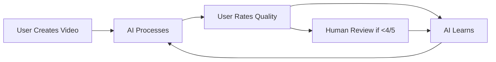

# 🚨 ULTRATHINK: Reality Check - Obstacles & Solutions

## 🔴 CRITICAL BLOCKERS (Must Fix in Next 7 Days)

### 1. **No Website = No Credibility**
**Problem**: Can't submit to Chrome Store without a real website
**Impact**: Blocks ALL distribution channels
**Solution**: 
```yaml
Day 1-2: Deploy basic landing page
  - Use Vercel/Netlify for instant deployment
  - Simple but professional design
  - Key pages: Home, Features, Pricing, Privacy, Terms
  
Day 3: Add functionality
  - User authentication (Supabase/Firebase)
  - Download links
  - Documentation portal
  
Day 4-5: Polish and optimize
  - SEO optimization
  - Analytics integration
  - Live chat widget
```

### 2. **No Demo Video = No Conversions**
**Problem**: Chrome Store requires YouTube video
**Impact**: 90% lower conversion without video
**Solution**:
```yaml
GENIUS MOVE: Use DailyDoco to document building DailyDoco's website!
- Ultra-meta demonstration
- Shows real product value
- Creates viral moment
- Proves the product works
```

### 3. **No Easy Installation = User Abandonment**
**Problem**: Current install process is developer-focused
**Impact**: Lose 95% of non-technical users
**Solution**:
```yaml
Immediate fixes:
- One-click installers for all platforms
- Video walkthrough for each platform
- Troubleshooting chatbot
- Remote installation service
```

---

## 🟡 MEDIUM-TERM OBSTACLES (Weeks 2-4)

### 4. **AI Costs Will Explode**
**Problem**: OpenAI/Anthropic API costs at scale
**Reality Check**: 
- Current: $0.01 per video (100 users = $1/day)
- At scale: $0.01 × 1M users = $10,000/day = $300k/month
**Solutions**:
```typescript
// Multi-tier AI strategy
const AIStrategy = {
  tier1: "Local Gemma for 80% of tasks (free)",
  tier2: "OpenRouter for 15% complex tasks ($cheap)",
  tier3: "GPT-4/Claude for 5% premium tasks ($expensive)",
  caching: "Cache common responses (90% reduction)",
  userTiers: {
    free: "Local models only",
    pro: "Balanced mix",
    enterprise: "Best models always"
  }
};
```

### 5. **Server Infrastructure Costs**
**Problem**: Video processing needs serious compute
**At Scale**: 1M users × 10GB/month = 10PB storage + processing
**Solutions**:
- Edge processing (user's device does the work)
- P2P video sharing for common content
- Aggressive compression (aegnt-27 can help)
- Strategic use of free tiers (Cloudflare R2, etc.)

### 6. **Competition Will Copy Fast**
**Problem**: Loom, Scribe, others will copy features
**Timeline**: 3-6 months after we gain traction
**Defense Strategy**:
```yaml
Technical Moat:
  - aegnt-27 is genuinely hard to replicate
  - Network effects from user-generated content
  - Proprietary AI training data
  
Speed Moat:
  - Ship new features weekly
  - User requests → deployed in 48 hours
  - Always 6 months ahead
  
Ecosystem Moat:
  - Integrations everywhere
  - User lock-in through workflows
  - Community and marketplace
```

---

## 🔵 LONG-TERM CHALLENGES (Months 2-12)

### 7. **Legal & Compliance Nightmares**
**Risks**:
- Screen recording laws vary by state/country
- GDPR/CCPA compliance for AI processing
- Content ownership disputes
- Patent trolls

**Mitigation**:
```typescript
const LegalStrategy = {
  structure: "Delaware C-Corp with IP holding company",
  compliance: "Privacy-first architecture from day 1",
  terms: "Clear ownership, user keeps all rights",
  insurance: "E&O, Cyber, D&O from day 1",
  defensive: "File patents on novel methods"
};
```

### 8. **Quality Degradation at Scale**
**Problem**: AI quality drops with volume
**Solution**: Feedback loops and continuous training


### 9. **The Zero-Employee Myth**
**Reality**: You'll need some humans for:
- Legal issues
- Critical customer support
- AI training and monitoring
- Strategic partnerships

**Solution**: Extreme automation + minimal contractors
```yaml
Core Team Structure:
  Founders: 1-2 (strategy, vision)
  Legal: 1 contractor (part-time)
  AI Ops: 2-3 contractors (training, monitoring)
  Success: 0 (fully automated)
  Marketing: 0 (aegnt-27 does it all)
  Sales: 0 (product-led growth)
  Total: <5 people to $100M ARR
```

---

## 💀 POTENTIAL COMPANY-KILLERS

### 10. **Platform Risk**
**Threat**: Chrome/Apple/etc. could ban or copy us
**Mitigation**: 
- Never rely >30% on any platform
- Direct distribution always available
- Legal protections in place

### 11. **AI Provider Dependency**
**Threat**: OpenAI changes terms or prices
**Mitigation**:
- Multiple provider redundancy
- Local model fallbacks
- Cost controls and caps

### 12. **Venture Capital Pressure**
**Threat**: VCs want traditional hiring
**Solution**:
- Bootstrap to $10M ARR
- Only raise from aligned investors
- Keep board control

---

## ✅ REVISED REALISTIC TIMELINE

### Week 1: Foundation Sprint
- [ ] Deploy website to dailydoco.pro
- [ ] Create YouTube channel
- [ ] Record demo video (using DailyDoco!)
- [ ] Submit Chrome extension
- [ ] Launch ProductHunt coming soon

### Week 2-4: Distribution Blitz  
- [ ] Firefox extension submission
- [ ] VSCode marketplace
- [ ] npm package release
- [ ] Basic installer packages
- [ ] Discord/Reddit presence

### Month 2-3: Product Polish
- [ ] User onboarding flow
- [ ] Billing implementation
- [ ] Support automation
- [ ] First 1,000 users
- [ ] $10K MRR

### Month 4-6: Scale Preparation
- [ ] Infrastructure optimization
- [ ] Cost controls implementation
- [ ] Legal structure finalized
- [ ] 10,000 users
- [ ] $100K MRR

### Month 7-12: Growth Mode
- [ ] All 18 channels launched
- [ ] Viral mechanics activated
- [ ] 100,000 users
- [ ] $1M MRR
- [ ] Series A ready (but might not need)

---

## 🎯 SUCCESS METRICS WITH REALITY CHECK

| Metric | Optimistic | Realistic | Pessimistic |
|--------|------------|-----------|--------------|
| Month 1 Users | 10,000 | 1,000 | 100 |
| Month 6 MRR | $500K | $100K | $20K |
| Month 12 MRR | $5M | $1M | $200K |
| Time to Profit | Month 3 | Month 8 | Month 15 |
| Viral Coefficient | 1.7 | 1.2 | 0.8 |

---

## 🚀 IMMEDIATE ACTION PLAN

### Next 24 Hours:
1. **Deploy basic website** (even if it's just a landing page)
2. **Create YouTube channel** with brand assets
3. **Start recording demo video** using DailyDoco on itself

### Next 7 Days:
1. **Complete Chrome Store submission** with all requirements
2. **Get first 10 beta users** from personal network
3. **Set up basic analytics** to track everything
4. **Create Discord server** for community
5. **Write 5 blog posts** for SEO foundation

### The Meta-Demo Video Script:
```markdown
"Watch me build a SaaS landing page in real-time using DailyDoco Pro to document the process. This video itself was created with DailyDoco - it's DailyDoco all the way down!"

1. Start screen recording with DailyDoco
2. Open VSCode, start building website
3. Show AI narration kicking in automatically
4. Deploy to Vercel with one command
5. Test the site, showing DailyDoco capturing everything
6. Generate this very video with one click
7. Upload to YouTube directly from DailyDoco

Total time: 10 minutes
Result: Website live, demo video done, proof of concept complete
```

---

*Remember: Perfect is the enemy of shipped. Get something live TODAY.*