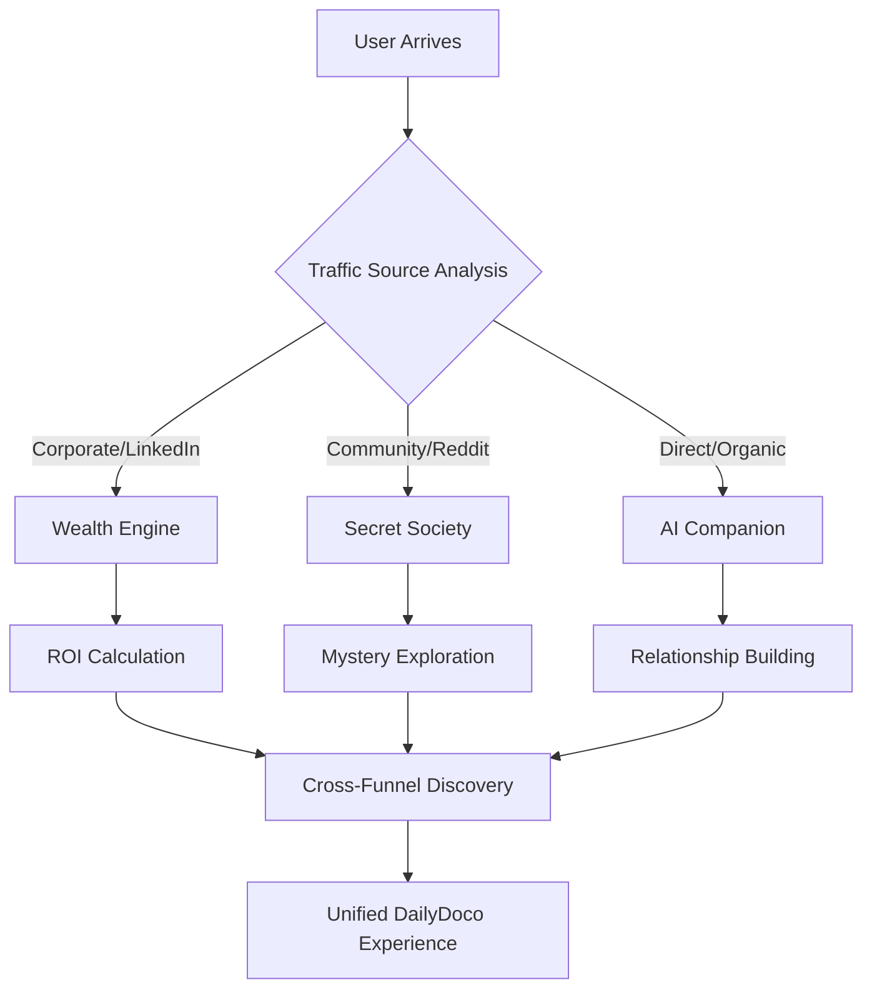

# DailyDoco Pro: Comprehensive Design Strategy & Implementation Guide

## Table of Contents

1. [Executive Summary](#executive-summary)
2. [Project Context & Architecture](#project-context--architecture)
3. [Design Philosophy & Approach](#design-philosophy--approach)
4. [Initial Design Concepts](#initial-design-concepts)
5. [Elite Funnel Designs](#elite-funnel-designs)
6. [Strategic Analysis Framework](#strategic-analysis-framework)
7. [Implementation Roadmap](#implementation-roadmap)
8. [Technical Integration Patterns](#technical-integration-patterns)
9. [Success Metrics & KPIs](#success-metrics--kpis)
10. [Action Items & Next Steps](#action-items--next-steps)

---

## Executive Summary

DailyDoco Pro represents a revolutionary automated documentation platform that transforms developer workflows into professional video tutorials with AI-powered narration, test audience validation, and human-like authenticity. This document captures the comprehensive design strategy developed through iterative exploration of six distinct front-end approaches, each targeting different user psychologies and value propositions.

### Key Innovations

- **Predictive Intelligence**: Captures important moments 30 seconds before they happen
- **AI Test Audiences**: 50-100 synthetic viewers evaluate content before publication
- **aegnt-27 Integration**: 98% AI detection resistance through peak human authenticity
- **Privacy-First Architecture**: Complete local processing with optional cloud sync
- **Multi-Platform Excellence**: Desktop (Tauri), Browser Extension, MCP Server

---

## Project Context & Architecture

### Core Technical Foundation

```typescript
// Priority Architecture Components
class ProjectFingerprinting {
  // 99%+ accuracy in project identification
  // Support: Git repos, npm/package.json, Docker, IDE workspaces
  // Real-time context switching detection
}

class ActivityTracker {
  // ML-based importance scoring for events
  // Battery-efficient monitoring (< 5% CPU usage)
  // Privacy-first data collection
}
```

### Performance Standards

- **Response Time**: < 100ms for all UI interactions
- **Resource Usage**: < 200MB RAM baseline, < 5% CPU during idle
- **Reliability**: 99.9% uptime, graceful degradation
- **Security**: Zero-trust architecture, AES-256 encryption

### Technology Stack

- **Core Backend**: Rust (video processing) + TypeScript (business logic)
- **Database**: SQLite + Redis + PostgreSQL
- **Video Processing**: Custom FFmpeg with GPU acceleration
- **Desktop**: Tauri (50% smaller than Electron)
- **AI Models**: DeepSeek R1 + Gemma 3 (hot-swappable)

---

## Design Philosophy & Approach

### Progressive Creativity Framework

Our design approach followed a structured progression:

1. **Foundation**: Developer-familiar interfaces
2. **Evolution**: Creative metaphors and emotional connections
3. **Transcendence**: Unique, never-before-seen experiences

### User Psychology Mapping

```
Developer Needs → Interface Design → Emotional Response → Engagement Pattern
     ↓                   ↓                   ↓                    ↓
  Efficiency      Terminal/Code        Familiarity          Daily Use
  Creativity      Cinematic/Film       Inspiration         Project-based
  Connection      AI Companion         Friendship          Continuous
  Achievement     Secret Society       Exclusivity         Goal-driven
  Value           Wealth Engine        Security            ROI-focused
```

---

## Initial Design Concepts

### Design 1: The Developer's Documentary Studio

*[Screenshot placeholder: Terminal-inspired interface with command-line aesthetics]*

**Core Concept**: Embrace developer comfort zones with terminal-style interface

**Key Features**:
- Command-line aesthetic with monospace fonts
- Terminal window components showing real code
- Process visualization as terminal commands
- Stats displayed as code metrics

**Target Audience**: Terminal purists, backend developers, DevOps engineers

**Psychological Hooks**:
- Familiarity breeds comfort
- Code as first-class citizen
- No context switching required

### Design 2: The Cinematic Documentation Atelier

*[Screenshot placeholder: Film production interface with director's viewfinder]*

**Core Concept**: Transform documentation into film production

**Key Features**:
- Director's viewfinder hero section
- Timeline editor mimicking video editing software
- Film strip navigation
- Credits roll footer

**Target Audience**: Creative developers, front-end specialists, content creators

**Psychological Hooks**:
- Every coding session is a story
- Developer as director/artist
- Production value emphasis

### Design 3: The Neural Documentation Collective

*[Screenshot placeholder: Cyberpunk neural interface with flowing connections]*

**Core Concept**: Documentation as consciousness upload

**Key Features**:
- Neural network background animation
- Memory banks as feature storage
- Synaptic connections visualization
- Consciousness terminal

**Target Audience**: Future-forward developers, AI enthusiasts, sci-fi fans

**Psychological Hooks**:
- Joining a collective mind
- Evolution and transcendence
- Cutting-edge technology adoption

---

## Elite Funnel Designs

### Funnel 1: The Documentation Wealth Engine

*[Screenshot placeholder: Financial dashboard with ROI calculator]*

**Core Value Proposition**: Transform code into measurable financial assets

**Conversion Mechanics**:
```javascript
const conversionPath = {
  entry: "ROI Calculator interaction",
  engagement: "Value visualization ($487,200/year)",
  trust: "Bank-level security signals",
  action: "Start Building Wealth CTA"
};
```

**Key Components**:
- Interactive ROI calculator with sliders
- Portfolio value tracking
- Growth timeline visualization
- Trust signals bar
- Success story carousel

**Psychological Triggers**:
- Loss aversion (missing out on value)
- Social proof (testimonials with numbers)
- Tangible benefits (dollar amounts)
- Investment mindset activation

### Funnel 2: Your Personal Documentation AI Companion

*[Screenshot placeholder: Friendly chat interface with evolving AI companion]*

**Core Value Proposition**: Never code alone again - DocuBot learns and grows with you

**Engagement Loop**:
```javascript
const companionCycle = {
  firstMeeting: "Personalized greeting",
  dailyInteraction: "Contextual help + celebrations",
  habitFormation: "Streaks and rewards",
  emotionalBond: "Companion evolution",
  retention: "Can't imagine coding without DocuBot"
};
```

**Key Components**:
- Live chat interface with personality
- Journey progression path
- Daily check-in rewards
- Companion evolution stages
- Emotional celebration moments

**Psychological Triggers**:
- Loneliness solution
- Gamification mechanics
- Personal growth visualization
- Positive reinforcement loops

### Funnel 3: The Secret Documentation Society

*[Screenshot placeholder: Mysterious society interface with locked content]*

**Core Value Proposition**: Join an exclusive order of elite documentarians

**Mystery Funnel Architecture**:
```javascript
const societyPath = {
  intrigue: "Secret order messaging",
  initiation: "Ritual interaction required",
  progression: "Unlock forbidden knowledge",
  status: "Climb the hierarchy",
  belonging: "Part of something greater"
};
```

**Key Components**:
- Initiation chamber with ritual
- Forbidden archives (locked/unlocked)
- Hierarchy pyramid system
- Daily mysteries countdown
- Secret abilities grid

**Psychological Triggers**:
- Exclusivity and scarcity
- Progressive revelation
- Status achievement
- Curiosity gaps
- Tribal belonging

---

## Strategic Analysis Framework

### Multi-Funnel Ecosystem Design



### Predictive Funnel Routing Algorithm

```typescript
interface FunnelSelector {
  analyzeUser(data: UserData): FunnelRecommendation {
    const signals = {
      timeOfDay: this.getTimeSegment(data.timestamp),
      trafficSource: this.parseReferrer(data.referrer),
      deviceType: this.detectDevice(data.userAgent),
      behaviorPattern: this.analyzeBehavior(data.interactions)
    };
    
    return this.mlModel.predict(signals);
  }
}
```

### Psychological Mapping Matrix

| User Type | Primary Need | Recommended Funnel | Conversion Trigger |
|-----------|--------------|-------------------|-------------------|
| Team Lead | ROI Justification | Wealth Engine | Value Calculator |
| Solo Dev | Connection | AI Companion | Daily Streaks |
| Early Adopter | Exclusivity | Secret Society | Limited Access |
| Enterprise | Trust & Scale | Wealth Engine | Security Signals |
| Creative | Self-Expression | AI Companion | Personalization |

---

## Implementation Roadmap

### Phase 1: Foundation (Weeks 1-2)
- [ ] Set up A/B testing framework
- [ ] Implement funnel routing logic
- [ ] Create analytics dashboard
- [ ] Mobile optimization pass

### Phase 2: Personalization (Weeks 3-4)
- [ ] User behavior tracking system
- [ ] Dynamic content adaptation
- [ ] Cross-session memory (cookies/localStorage)
- [ ] Personalized messaging engine

### Phase 3: Integration (Weeks 5-6)
- [ ] Connect to backend services
- [ ] Implement authentication flow
- [ ] Set up payment processing
- [ ] Launch referral system

### Phase 4: Optimization (Weeks 7-8)
- [ ] Performance testing and optimization
- [ ] Conversion rate optimization
- [ ] User feedback integration
- [ ] Scale testing

---

## Technical Integration Patterns

### Backend Service Connections

```typescript
// Modular service integration pattern
class FunnelIntegrationLayer {
  private services = {
    capture: new CaptureService(),
    ai: new AegntService(),
    video: new VideoProcessor(),
    analytics: new AnalyticsEngine()
  };
  
  async enhanceFunnelWithLiveData(funnelType: FunnelType) {
    switch(funnelType) {
      case 'wealth':
        return {
          liveROI: await this.services.analytics.calculateROI(),
          processingSpeed: await this.services.video.getSpeed()
        };
      
      case 'companion':
        return {
          aiPersonality: await this.services.ai.getPersonality(),
          userProgress: await this.services.analytics.getUserStats()
        };
      
      case 'society':
        return {
          memberCount: await this.services.analytics.getActiveUsers(),
          unlockedSecrets: await this.services.ai.getFeatureFlags()
        };
    }
  }
}
```

### Feature Flag System

```typescript
// Progressive feature revelation
const featureUnlockSystem = {
  wealth: {
    basic: ['calculator', 'timeline'],
    pro: ['detailed_analytics', 'team_sharing'],
    enterprise: ['api_access', 'white_label']
  },
  companion: {
    level1: ['basic_chat', 'daily_greeting'],
    level5: ['personality_evolution', 'predictive_help'],
    level10: ['custom_personality', 'advanced_insights']
  },
  society: {
    initiate: ['basic_archives', 'daily_mystery'],
    adept: ['aegnt27_access', 'time_manipulation'],
    master: ['all_seeing_eye', 'reality_bending']
  }
};
```

---

## Success Metrics & KPIs

### Primary Conversion Metrics

| Funnel | Target Conversion | Engagement Metric | Retention Signal |
|--------|------------------|-------------------|------------------|
| Wealth Engine | 8% signup | Calculator completion | Weekly value checks |
| AI Companion | 12% signup | Daily chat interaction | 7-day streak rate |
| Secret Society | 15% signup | Secrets unlocked | Rank progression |

### Secondary Performance Indicators

```typescript
const performanceMetrics = {
  pageLoadSpeed: '< 2s',
  interactionLatency: '< 100ms',
  mobileResponsiveness: '100% feature parity',
  accessibilityScore: 'WCAG 2.1 AA compliant',
  seoOptimization: 'Core Web Vitals green'
};
```

### User Journey Analytics

1. **Entry Point Distribution**
   - Monitor which funnel attracts which traffic
   - Optimize ad spend based on funnel performance

2. **Cross-Funnel Discovery Rate**
   - Track users who experience multiple funnels
   - Measure impact on lifetime value

3. **Emotional Engagement Score**
   - Sentiment analysis on companion chats
   - Mystery completion rates in society
   - Value exploration depth in wealth engine

---

## Action Items & Next Steps

### Immediate Actions (Week 1)

1. **Design Team**
   - [ ] Finalize responsive designs for all funnels
   - [ ] Create design system documentation
   - [ ] Prepare handoff to development

2. **Development Team**
   - [ ] Set up routing infrastructure
   - [ ] Implement analytics framework
   - [ ] Create component library

3. **Marketing Team**
   - [ ] Develop funnel-specific messaging
   - [ ] Create ad variations for testing
   - [ ] Plan launch campaign

### Strategic Initiatives (Month 1)

1. **User Research**
   - Conduct usability testing on each funnel
   - Interview target personas
   - Analyze competitor approaches

2. **Technical Infrastructure**
   - Scale testing for concurrent users
   - Implement CDN for global performance
   - Set up monitoring and alerting

3. **Content Strategy**
   - Develop funnel-specific content calendars
   - Create onboarding email sequences
   - Design retention campaigns

### Long-term Vision (Quarter 1)

1. **Ecosystem Development**
   - Build community features for each funnel
   - Create cross-funnel achievement system
   - Develop mobile apps with funnel themes

2. **AI Enhancement**
   - Train ML models on user behavior
   - Implement predictive funnel optimization
   - Create personalized journey paths

3. **Market Expansion**
   - Localize funnels for global markets
   - Partner with developer communities
   - Launch enterprise-specific funnels

---

## Conclusion

The DailyDoco Pro front-end strategy represents a paradigm shift in how developer tools approach user acquisition. By creating three distinct yet interconnected experiences, we accommodate the full spectrum of developer psychologies while maintaining a cohesive brand vision.

Each funnel serves as both a standalone conversion path and a gateway to a larger ecosystem. Whether users are driven by financial value, emotional connection, or exclusive belonging, they'll find an entry point that resonates with their deepest motivations.

The true innovation lies not in any single design, but in the recognition that developers are multifaceted individuals who deserve experiences as rich and varied as the code they write. DailyDoco Pro doesn't just document code—it celebrates the human journey of creation.

---

*Document Version: 1.0*  
*Last Updated: [Current Date]*  
*Next Review: [Date + 2 weeks]*