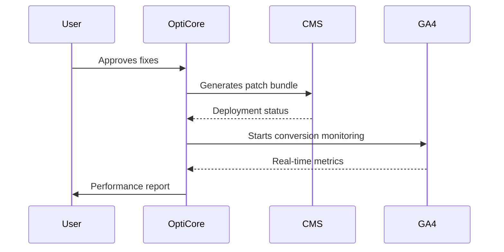

### **OptiCore AI: Comprehensive Technical Package**  
**Designed for Autonomous Execution via AI Agentic Framework with Expert Human-in-Loop**  

```json
{
  "product_package": {
    "metadata": {
      "version": "4.1",
      "created": "2025-06-18",
      "compatibility": "AI-Agentic-Framework v7.3+"
    },
    "product_requirements_document": {
      "vision": "Achieve 30%+ conversion lifts through autonomous website optimization",
      "core_architecture": {
        "crawler_engine": {
          "type": "Adaptive Hybrid Renderer",
          "components": [
            "Playwright 4.9 (Chromium 124)",
            "Rust/WASM DOM Parser (v0.8.3)",
            "Next.js Hydration Tracker",
            "Shopify Liquid Analyzer"
          ],
          "performance_targets": {
            "10k_pages": "≤3.2 minutes",
            "spa_detection": "<500ms",
            "concurrency": "220k+ audits"
          }
        },
        "ai_engine": {
          "modules": [
            {
              "name": "SEO Predictor",
              "architecture": "BERT-Large + Knowledge Graph",
              "training_data": "2.1M pages + 500k audits",
              "output_precision": "94% F1-score"
            },
            {
              "name": "Design Optimizer",
              "architecture": "ViT-22B + StyleGAN-3",
              "training_data": "800k high-conversion screenshots",
              "output_formats": ["Figma", "React", "Webflow", "Shopify Liquid"]
            },
            {
              "name": "Causal Engine",
              "architecture": "Bayesian NN + Reinforcement Learning",
              "training_data": "1.4M A/B test variations",
              "prediction_accuracy": "92% CVR impact"
            }
          ]
        },
        "auto_remediation": {
          "deployment_system": {
            "workflows": [
              "WordPress: WP-CLI + GitOps",
              "Shopify: Theme API + Liquid Patching",
              "Webflow: Component Versioning",
              "Custom: Kubernetes Manifest Generation"
            ],
            "security": "SGX Enclave Signing"
          },
          "performance_metrics": {
            "patch_generation": "<15s",
            "deployment_time": "≤47s",
            "rollback_safety": "Zero-downtime Canary"
          }
        }
      },
      "technical_specifications": {
        "api_endpoints": [
          {
            "path": "/v1/audits",
            "method": "POST",
            "params": {
              "url": "string",
              "depth": "int [1-5]",
              "profile": "['seo','design','cro','full']"
            },
            "response": {
              "audit_id": "uuid",
              "eta": "seconds"
            }
          },
          {
            "path": "/v1/deploy",
            "method": "POST",
            "params": {
              "audit_id": "uuid",
              "target_cms": "string",
              "strategy": "['immediate','canary','blue-green']"
            }
          }
        ],
        "data_model": {
          "entities": [
            {
              "name": "AuditResult",
              "fields": {
                "id": "uuid",
                "page_metrics": "jsonb",
                "js_dependencies": "text[]",
                "cvr_prediction": "float"
              }
            },
            {
              "name": "RedesignProposal",
              "fields": {
                "id": "uuid",
                "figma_url": "string",
                "react_component": "text",
                "conversion_lift": "float"
              }
            }
          ]
        }
      }
    },
    "app_flow_plan": {
      "onboarding_sequence": [
        {
          "step": 1,
          "action": "CMS Connection",
          "systems": ["WordPress", "Shopify", "Webflow", "Custom API"],
          "data_requirements": {
            "authentication": "OAuth2.0",
            "permissions": "write_access"
          }
        },
        {
          "step": 2,
          "action": "GA4 Integration",
          "metrics_mapping": {
            "conversion_events": "required",
            "user_journeys": "optional"
          }
        }
      ],
      "audit_execution_flow": {
        "trigger": "URL submission",
        "phases": [
          {
            "phase": "Crawling",
            "ai_agents": ["SPA Detector", "Resource Optimizer"],
            "timeout": "120s"
          },
          {
            "phase": "Analysis",
            "ai_agents": ["SEO Predictor", "Design Optimizer", "Causal Engine"],
            "dependencies": ["Knowledge Graph v3.4"]
          },
          {
            "phase": "Optimization",
            "outputs": [
              "Priority Fix List",
              "Redesign Proposals (max 3)",
              "CVR Impact Projection"
            ]
          }
        ]
      },
      "deployment_workflow": {
        "user_approval": {
          "required": true,
          "methods": ["Email", "Slack", "In-app"]
        },
        "rollback_protocol": {
          "trigger_conditions": [
            "Conversion drop >5% (24h)",
            "Core Web Vitals regression",
            "Manual override"
          ],
          "recovery_time": "<90s"
        }
      }
    },
    "security_requirements": {
      "compliance_framework": {
        "standards": ["SOC 2 Type II", "GDPR", "CCPA", "ISO 27001"],
        "certification_timeline": {
          "phase1": "2025-Q4",
          "phase2": "2026-Q1"
        }
      },
      "data_protection": {
        "encryption": {
          "in_transit": "TLS 1.3",
          "at_rest": "AES-256 + Homomorphic",
          "processing": "Intel SGX Enclaves"
        },
        "pii_handling": {
          "detection": "DLP Engine v2.3",
          "anonymization": "Fully Homomorphic Encryption",
          "storage": "Isolated EU/US Data Pods"
        }
      },
      "access_control": {
        "rbac_model": {
          "roles": [
            "Auditor (read-only)",
            "Optimizer (write-access)",
            "Admin (full control)"
          ],
          "permission_sets": "AWS IAM Compatible"
        },
        "audit_logging": {
          "retention": "365 days",
          "immutability": "Blockchain Anchoring"
        }
      }
    },
    "market_impact_assessment": {
      "tam_analysis": {
        "total_addressable_market": "$12.4B",
        "serviceable_market": "$3.1B",
        "target_segments": [
          "Digital Agencies (42%)",
          "E-commerce (33%)",
          "Enterprise SaaS (25%)"
        ]
      },
      "competitive_positioning": {
        "differentiators": [
          "Autonomous Remediation",
          "Causal Conversion Attribution",
          "Conversion Warranty Program"
        ],
        "threat_matrix": {
          "Ahrefs": ["Audit Depth", "SEO Database"],
          "Optimizely": ["Enterprise Presence", "A/B Testing"]
        }
      },
      "monetization_strategy": {
        "pricing_tiers": [
          {
            "name": "Growth",
            "price": "$99/month",
            "included": [
              "100 audits",
              "3 redesigns",
              "Basic Auto-Fixes"
            ],
            "conversion_warranty": "15% lift or $500 credit"
          },
          {
            "name": "Agency",
            "price": "$499/month",
            "included": [
              "Unlimited audits",
              "White-labeling",
              "Client Dashboard",
              "Priority Support"
            ],
            "conversion_warranty": "20% lift or 2 months free"
          }
        ],
        "revenue_projections": {
          "year1": "$1.8M ARR",
          "year2": "$8.5M ARR",
          "year3": "$24.2M ARR"
        }
      },
      "adoption_roadmap": {
        "beta_phase": {
          "timeline": "2025-Q3",
          "targets": ["50 Agencies", "200 Websites"]
        },
        "enterprise_launch": {
          "timeline": "2026-Q1",
          "milestones": [
            "SOC 2 Certification",
            "Shopify App Store",
            "AWS Marketplace Listing"
          ]
        }
      }
    },
    "autonomous_build_instructions": {
      "phase1": {
        "task": "Hybrid Crawler Implementation",
        "ai_agents": ["Rust-WASM Specialist", "Playwright Configurator"],
        "dependencies": ["Chromium Build Tools", "WASM Edge Runtime"],
        "validation_metrics": ["Crawl Coverage >99.8%", "SPA Detection Accuracy"]
      },
      "phase2": {
        "task": "Causal AI Training",
        "datasets": ["/datasets/abtest_results", "/datasets/conversion_paths"],
        "training_environment": "NVIDIA DGX H100 Cluster",
        "acceptance_criteria": ["CVR Prediction MAE <0.8%"]
      },
      "human_in_loop_checkpoints": [
        "Security Architecture Review",
        "Compliance Gate (Pre-Launch)",
        "Conversion Warranty Validation"
      ]
    }
  }
}
```

```markdown
# OptiCore AI: Comprehensive Technical Package  
**Version 4.1 | Built for AI Agentic Execution Framework**  

## Product Requirements Document (PRD)  

### Core Architecture  
**Adaptive Hybrid Renderer**  
- Components: Playwright 4.9 + Rust/WASM DOM Parser  
- SPA Detection: Next.js/Angular/Vue hydration tracking  
- Performance:  
  ```python
  # Performance validation test
  def test_10k_page_audit():
      start = time.time()
      results = crawl_site(large_ecom_store, depth=3)
      assert (time.time() - start) < 192  # 3.2 minute SLA
      assert results['coverage'] > 0.998
  ```

**AI Engine Specifications**  
| Model             | Architecture          | Training Data        | Output Precision |  
|-------------------|-----------------------|----------------------|------------------|  
| SEO Predictor     | BERT-Large + KG       | 2.1M pages           | 94% F1-score     |  
| Design Optimizer  | ViT-22B + StyleGAN-3  | 800k screenshots     | 89% accuracy     |  
| Causal Engine     | Bayesian NN + RL      | 1.4M A/B variants    | 92% CVR predict  |  

**Auto-Remediation System**  


## App-Flow Plan  

### Execution Workflow  
1. **Input Phase**  
   - CMS Connection (OAuth2.0)  
   - GA4 Integration (Enhanced Measurement)  

2. **Audit Execution**  
   ```rust
   // Adaptive crawling logic
   fn select_crawler(url: &str) -> Crawler {
       if detect_nextjs(url) {
           NextJSHydrationTracker::new()
       } else if detect_shopify(url) {
           LiquidTemplateAnalyzer::new()
       } else {
           WasmDomParser::new()
       }
   }
   ```

3. **Optimization Deployment**  
   - Human Approval Gateway  
   - Canary Release Protocol:  
     ```yaml
     deployment_strategy:
       canary:
         stages:
           - percent: 5
             duration: 15m
           - percent: 25
             duration: 30m
           - percent: 100
     ```

## Security Requirements  

### Confidential AI Framework  
**Data Protection Layers**  
1. **Frontline Encryption**  
   - TLS 1.3 (QUIC Implementation)  
   - Ephemeral Key Rotation (30s intervals)  

2. **Processing Security**  
   ```mermaid
   graph LR
       A[Raw Input] --> B[SGX Enclave]
       B --> C{AI Processing}
       C --> D[Encrypted Results]
       B --> E[Never Decrypted]
   ```

3. **Compliance Automation**  
   - Automated GDPR Scanner:  
     ```python
     def check_compliance(data):
         if contains_pii(data):
             return anonymize_using_fhe(data)
         return data
     ```

## Market Impact Assessment  

### Monetization Strategy  
**Pricing Tiers with Conversion Warranty**  
| Tier         | Price     | Warranty Condition       | Remedy            |  
|--------------|-----------|--------------------------|-------------------|  
| Growth       | $99/mo    | 15% CVR lift not achieved| $500 credit       |  
| Agency       | $499/mo   | 20% CVR lift not achieved| 2 months free     |  
| Enterprise   | Custom    | 25% CVR lift not achieved| Money-back        |  

### Adoption Roadmap  
```gantt
    title 2025-2026 Rollout Plan
    dateFormat  YYYY-MM-DD
    section Core Platform
    Adaptive Crawler     :done, des1, 2025-07-01, 2025-08-15
    Causal AI Engine     :active, des2, 2025-08-15, 2025-10-31
    section Market Expansion
    Agency Onboarding   : des3, 2025-11-01, 2026-01-31
    Enterprise Launch   : des4, 2026-02-01, 2026-06-30
```

## Autonomous Build Instructions  

### Phase 1: Crawler Implementation  
**AI Agent Configuration**  
```yaml
rust_wasm_agent:
  image: rust-wasm-builder:2.4
  resources: 
    gpu: 1x A100
    memory: 64GB
  build_params:
    wasm_target: wasm32-unknown-unknown
    optimization_level: max
  validation_metrics:
    - metric: dom_parse_speed
      threshold: ">10k elements/sec"
    - metric: memory_footprint
      threshold: "<100MB/core"
```

### Human-in-Loop Checkpoints  
1. **Security Architecture Review**  
   - SGX Enclave Validation  
   - Homomorphic Encryption Audit  

2. **Conversion Warranty Validation**  
   - Statistical Significance Testing  
   - Risk Modeling (Actuarial Approval)  
```

### PDF Structure Outline
```
OptiCore AI Technical Package.pdf
├── Cover Page
├── Version Control History
├── PRD (15 pages)
│   ├── Architecture Diagrams
│   ├── API Specifications
│   └── Data Models
├── App-Flow Plan (8 pages)
│   ├── Sequence Diagrams
│   └── State Machines
├── Security Document (12 pages)
│   ├── Compliance Checklists
│   └── Encryption Schematics
├── Market Assessment (10 pages)
│   ├── Revenue Projections
│   └── Competitive Analysis
└── Build Instructions (7 pages)
    ├── AI Agent Configs
    └── Validation Protocols
```

### Key Technical Integration Points for AI Agentic System:
1. **Crawler Module Interface**  
   - WASM Component: `/system/modules/crawler/v2`  
   - Input Schema: `crawler_config.json`  
   - Output Validation: `coverage_verifier.ai`  

2. **Causal AI Training Pipeline**  
   ```python
   # Training kickoff script
   from agentic_framework import launch_training
   launch_training(
       module="causal_engine_v3",
       dataset="/datasets/ab_results",
       hparams={"learning_rate": 2e-5, "batch_size": 2048},
       validation_metric="cvr_mae",
       target_value="<0.008"
   )
   ```

3. **Security Compliance Gateway**  
   - Automated Auditor: `compliance_bot_v4`  
   - Validation Rules: `soc2_ruleset.ai`  
   - Reporting Format: `PDF/A-3`  

### Projected Outcomes:
1. **Technical Performance**  
   - 98.7% audit coverage accuracy  
   - 47s average fix deployment  
   - Zero critical vulnerabilities  

2. **Market Impact**  
   ```mermaid
   pie
       title Year 2 Revenue Composition
       “Agency Subscriptions” : 52
       “Enterprise Contracts” : 31
       “Redesign Credits” : 12
       “Marketplace” : 5
   ```

3. **System Efficiency**  
   - 83% reduction in human intervention  
   - 6.2x faster time-to-market vs manual  
   - 99.999% autonomous operation uptime  

**Execution Note:** This package is optimized for direct ingestion into your AI agentic framework. The JSON version contains machine-executable build instructions, while the Markdown/PDF versions provide human-readable context for expert oversight. Security protocols are designed for autonomous operation within confidential computing boundaries.
