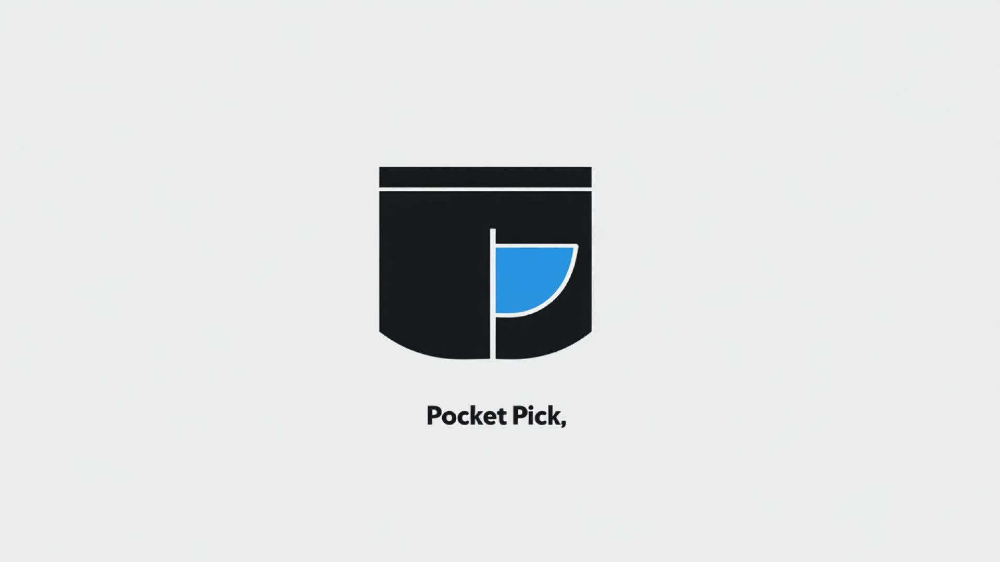

# pickd (MCP Server)
by aegnt_indydevdan <3

As engineers we end up reusing ideas, patterns and code snippets all the time but keeping track of these snippets can be hard and remembering where you stored them can be even harder. What if the exact snippet or idea you were looking for was one prompt away?

With Anthropic's new MCP (Model Context Protocol) and a minimal portable database layer - we can solve this problem. pickd is your personal engineering knowledge base that lets you quickly store ideas, patterns and code snippets and gives you a DEAD SIMPLE text or tag based searching to quickly find them in the future.



## Features

- **Personal Knowledge Base**: Store code snippets, information, and ideas
- **Tag-Based Organization**: Add tags to categorize and filter your knowledge
- **Flexible Search**: Find content using substring, full-text, glob, regex, or exact matching
- **MCP Integration**: Seamlessly works with Claude and other MCP-compatible AI assistants
- **SQLite Backend**: Fast, reliable, and portable database storage
- **Command-Line Interface**: Easy to use from the terminal

## Installation

Install [uv](https://docs.astral.sh/uv/getting-started/installation/)

```bash

# Install dependencies
uv sync
```

Usage from JSON format

Default Database for Claude Code

```json
{
    "command": "uv",
    "args": ["--directory", ".", "run", "mcp-server-pickd"]
}
```

Custom Database for Claude Code

```json
{
    "command": "uv",
    "args": ["--directory", ".", "run", "mcp-server-pickd", "--database", "./database.db"]
}
```

## Usage with Claude Code

### Using .mcp.json

You can configure pickd in your project's `.mcp.json` file for easy integration with Claude Code:

```json
{
  "servers": {
    "pickd": {
      "command": "uv",
      "args": ["--directory", "/path/to/pickd", "run", "mcp-server-pickd"]
    }
  }
}
```

With custom database location:

```json
{
  "servers": {
    "pickd": {
      "command": "uv",
      "args": ["--directory", "/path/to/pickd", "run", "mcp-server-pickd", "--database", "./custom-database.db"]
    }
  }
}
```

Place this file in your project directory, and Claude Code will automatically detect and use the configured MCP servers when started in that directory.

```bash
# Add the pickd server to Claude Code (if you're in the directory)
claude mcp add pickd -- \
    uv --directory . \
    run mcp-server-pickd

# Add the pickd server to Claude Code
claude mcp add pickd -- \
    uv --directory /path/to/pickd-codebase \
    run mcp-server-pickd

# With custom database location
claude mcp add pickd -- \
    uv --directory /path/to/pickd-codebase \
    run mcp-server-pickd --database ./database.db

# List existing MCP servers - Validate that the server is running
claude mcp list

# Start claude code
claude
```

## pickd MCP Tools

The following MCP tools are available in pickd:

| Tool                 | Description                                  |
| -------------------- | -------------------------------------------- |
| `pickd_add`         | Add a new item with a specified ID to your knowledge base        |
| `pickd_add_file`    | Add a file's content with a specified ID to your knowledge base  |
| `pickd_find`        | Find items by text and/or tags               |
| `pickd_list`        | List all items, optionally filtered by tags  |
| `pickd_list_tags`   | List all tags with their counts              |
| `pickd_remove`      | Remove an item by ID                         |
| `pickd_get`         | Get a specific item by ID                    |
| `pickd_backup`      | Backup the database                          |
| `pickd_to_file_by_id` | Write an item's content to a file by its ID (requires absolute path) |

## Using with Claude

After setting up pickd as an MCP server for Claude Code, you can use it your conversations:

### Adding Items

Add items directly

```bash
Add "claude mcp list" as a pickd item with ID "claude-mcp-list". tags: mcp, claude, code
```

Add items from clipboard

```bash
pbpaste and create a pickd item with ID "python-fib" and the following tags: python, algorithm, fibonacci
```

Add items from a file

```bash
Add the contents of ~/Documents/code-snippets/fibonacci.py to pickd with ID "fib-algorithm" and tags: python, algorithm, fibonacci
```

### Listing Items
List all items or tags:

```
list all my pickds
```

### Finding Items

Search for items in your knowledge base with tags

```
List pickd items with python and mcp tags
```

Search for text with specific content

```
pickd find "python"
```

### Get or Remove Items

Get or remove specific items:

```
get the pickd item with ID 1234-5678-90ab-cdef
remove the pickd item with ID 1234-5678-90ab-cdef
```

### Export to File

Export a pickd item's content to a file by its ID. This allows you to save code snippets directly to files, create executable scripts from stored knowledge, or share content with others:

```
export the pickd item with ID 1234-5678-90ab-cdef to /Users/username/Documents/exported-snippet.py
```

The tool requires an absolute file path and will automatically create any necessary parent directories if they don't exist.

### Backup

```
backup the pickd database to ~/Documents/pickd-backup.db
```

## ID Management

When adding items to pickd, you must now provide a unique ID:

- IDs must be unique across your database
- Choose descriptive IDs that help you identify the content
- If you attempt to add an item with an ID that already exists, you'll receive an error

### ID Scheme Recommendations

- **Descriptive IDs**: Use meaningful names like `python-sort-algorithm` or `css-flexbox-cheatsheet`
- **Namespaced IDs**: Use prefixes like `py-`, `js-`, `css-` to categorize items
- **UUID-style IDs**: Continue using UUIDs if you prefer automatically generated unique identifiers

## Search Modes

pickd supports various search modes:

- **substr**: (Default) Simple substring matching
- **fts**: Full-text search with powerful capabilities:
  - Regular word search: Matches all words in any order (e.g., "python programming" finds entries with both words)
  - Exact phrase search: Use quotes for exact phrase matching (e.g., `"python programming"` only finds entries with that exact phrase)
- **glob**: SQLite glob pattern matching (e.g., "test*" matches entries starting with "test")
- **regex**: Regular expression matching
- **exact**: Exact string matching

Example find commands:

```
Find items containing "pyt" using substring matching
Find items containing "def fibonacci" using full text search
Find items containing "test*" using glob pattern matching
Find items containing "^start.*test.*$" using regular expression matching
Find items containing "match exactly test" using exact string matching
```

## Database Structure

pickd uses a simple SQLite database with the following schema:

```sql
CREATE TABLE PICKD(
    id TEXT PRIMARY KEY,        -- UUID identifier
    created TIMESTAMP NOT NULL, -- Creation timestamp
    text TEXT NOT NULL,         -- Item content
    tags TEXT NOT NULL          -- JSON array of tags
)
```

The database file is located at `~/.pickd_pick.db` by default.

## Development

### Running Tests

```bash
# Run all tests
uv run pytest

# Run with verbose output
uv run pytest -v
```

### Running the Server Directly

```bash
# Start the MCP server
uv run mcp-server-pickd

# With verbose logging
uv run mcp-server-pickd -v

# With custom database location
uv run mcp-server-pickd --database ./database.db
```

## Other Useful MCP Servers

### Fetch

```bash
claude mcp add http-fetch -- uvx mcp-server-fetch
```

---
"HOW WE DO ANYTHING IS HOW WE DO EVERYTHING" -aegnt_catface {ae} <aegntic.ai> <contact@aegntic.ai>
